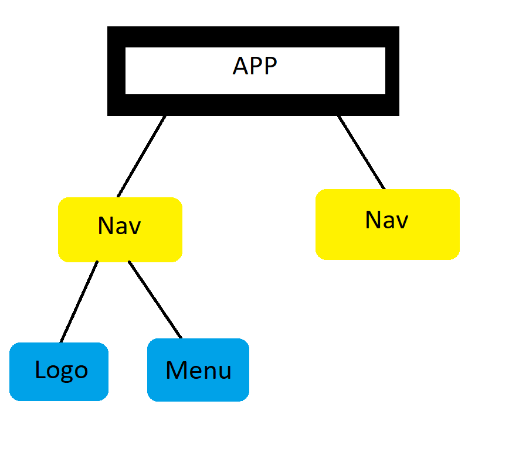

## Components

Up until now we worked in App.js but ultimately, when you're creating full websites you'll need more than just one component. A website would typically be made up of many different components, where each component would be responsible for a specific section of the site. For example: Navbar, Footer, Sidebar, each individual Card => Images, Posts, Blog Post etc...

Now the way we work with multiple components on a page is by nesting them inside the root app components and when we nest components like this, we form what looks like a component tree in diagram form.
For example in our case:
```mermaid
    App-->Navbar;
    App-->EventList;
    Navbar-->Logo;
    Navbar-->Menu;
```

_Incase Diagram doesn't work_

Second Nav should be EventList

This is our component that's ultimately injected into the DOM by React Dom and that render method
Then inside the app component, we could nest two more components Navbar component and an EventList components that maybe inside those components We could also nest all the other components inside like: Navbar, nest Logo component for the site logo and maybe a menu component for outputting enough bar links

And most importantly each one of these components would have it's own file, it's own component function and it's own template


examples: 

How to import a component
```jsx
    import Example from './components/Example'
```

How to use the imported component
```jsx
<Example />
```

or
```jsx
<Example></Example>
```