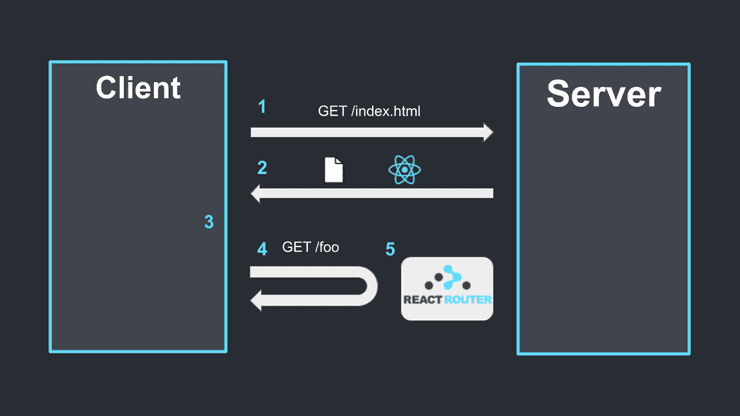

#  Links und Navigationslinks

 
Jetzt funktionieren unsere **drei verschiedenen Routes**, aber im Moment können wir sie nur über die **URL** des Browsers erreichen. Stattdessen wollen wir ein paar ```<a href="#">Links</a>``` in die **Nav** packen, auf die wir einfach klicken können, um die **Pages** aufzurufen.

Was ich also tun werde, ist ein **a-Tag**, bei dem die **href** nur ein **/** sein wird, und das wird für die **Home-Page** sein und dann das gleiche für alle anderen **Pages**:


```jsx

return  (

<div  className="App">

<BrowserRouter>

<nav>

<h1>My Articles</h1>

<a  href="/">Home</a>

<a  href="/about">About us</a>

<a  href="/contact">Contact us</a>

</nav>

```


Wenn wir nun auf diese ```<a href="#">Links</a>``` klicken, sollten wir zu unseren **Pages** bzw. **Components** gelangen, richtig? 🤔

Probieren wir das mal aus, damit wir alle Links in der **Nav** sehen können.
  
Wenn wir auf **About us** klicken, wird **/about** angezeigt, und wir sehen, dass das **About-Component** funktioniert. Dasselbe gilt dann auch für die anderen beiden Pages. 🤗

Das ist zwar alles schön und toll, aber ich habe euch *jebaited* und in Wirklichkeit ist das nicht die Art und Weise, wie wir mit React arbeiten sollten, denn jedes Mal, wenn wir auf einen **a-Tag** klicken, senden wir ein neues **Request** (Anfrage) an den Server. Dieser antwortet dann jedes Mal mit einer **leeren HTML-Page** und erst dann injected React das passende Component für diese Route (Stichwort: **Matching**).

Schaut euch unser Refresh-Icon an, es aktualisiert sich, und das wollen wir vermeiden!
Wenn wir mit React arbeiten, dreht sich alles darum, diese Requests an den Server abzufangen (**Interception**).



Sagen wir, wir haben das ganze auf Vercel gehostet:

***TL***;***DR**:* *mit normalen a-Tag geht's erst zurück zu Vercel, dann wird eine neue HTML-Page angefordert und dieses wird dann dem User angezeigt. Das macht's sehr lahm, es braucht Zeit und muss im Grunde immer alles neu laden. Was Router-Dom also macht, wird der Link geklickt, ist es, zu sagen: "Nein, keine Requests an diesen Server! Hier, nimm's stattdessen von mir!*

 

Um zu sehen, dass wir tatsächlich einen Request senden, gehe mit F12 im Browser zur Entwicklerkonsole:

> Netzwerk

> Löschen

> Auf eine andere Page gehen

> Wie du siehst, fragen wir nach einer bestimmten Page => Contact, About, Home

> Wir erhalten eine HTML-Datei zurück

Wenn du auf diese Datei klickst, erhältst du eine leere HTML-Page, die du bereits in der Öffentlichkeit hast. Probiere es einfach mit verschiedenen Seiten aus und überzeuge dich selbst.


##  Der richtige Weg


Die Art und Weise, wie wir dies in React tun, ist die Verwendung einer speziellen Komponente namens Link-Komponente anstelle von Anker-Tags.

Wir müssen diese also zunächst importieren:

```jsx

import  { BrowserRouter,  Route,  Switch,  Link }  from  "react-router-dom";

```

Jetzt können wir alle unsere a-Tags durch Link-Komponenten ersetzen
```jsx

<nav>

<h1>My Articles</h1>

<Link to="/">Home</Link>

<Link to="/about">About</Link>

<Link to="/contact">Contact</Link>

</nav>

```

**STOP**: Wenn du es irgendwie in **0_introDE.md** verpasst hast, deine **index.js** zu aktualisieren, wird es nicht funktionieren, also geh zurück und mach den Schritt neu!!! *pathetic...* 😒

Wenn wir jetzt den Netzwerk-Tab öffnen, wird kein Request gesendet,; nice see ya later!!

SYKE, jetzt reden wir über... &nbsp;&nbsp;&nbsp;&nbsp;&nbsp;&nbsp;&nbsp;&nbsp;&nbsp;&nbsp;&nbsp;&nbsp;&nbsp;&nbsp;&nbsp;&nbsp;&nbsp;&nbsp;&nbsp;&nbsp;&nbsp;&nbsp;&nbsp;&nbsp;&nbsp;&nbsp;&nbsp;&nbsp;&nbsp;&nbsp;&nbsp;&nbsp;&nbsp;&nbsp;&nbsp;&nbsp;&nbsp;&nbsp;&nbsp;&nbsp;&nbsp;&nbsp;&nbsp;&nbsp;&nbsp;&nbsp;&nbsp;&nbsp;&nbsp;&nbsp;&nbsp;&nbsp;&nbsp;&nbsp;&nbsp;&nbsp;&nbsp;&nbsp;&nbsp;&nbsp;&nbsp;&nbsp;&nbsp;&nbsp;&nbsp;&nbsp;&nbsp;&nbsp;&nbsp;&nbsp;&nbsp;&nbsp;&nbsp;&nbsp;&nbsp;<span>Joe Mama :^)</span>

I mean...


##  NavLink


Wir können wieder alles importieren, was wir brauchen, darunter jetzt neu **NavLink**:


```jsx

import  { BrowserRouter,  Route,  Switch,  Link,  NavLink }  from  "react-router-dom";

```

  
Wir können auch alle **< Links />** zu **< NavLink />** ändern:

  
```jsx

<nav>

<h1>My Articles</h1>

<NavLink to="/">Home</NavLink>

<NavLink to="/about">About</NavLink>

<NavLink to="/contact">Contact</NavLink>

</nav>

```

  
Was ist nun der Unterschied zwischen **Link-** und **NavLink-Components**?

**Der Hauptunterschied ist, dass dieses Component für die Navigation gedacht ist, denn sie fügt jedem Link (a-Tag) ein class="active" hinzu, der gerade aktiv ist.**

Nehmen wir an, wir klicken auf den **About-Link**. Wenn der **Request** jetzt folgt und daraufhin **gematched** wird, geht es darum, ob dieses **Path** auch das ist, was wir im Browser sehen, wenn ja, dann wird eine **class="active"** diesem bestimmten **a-Tag** hinzugefügt, damit wir ihn im CSS **stylen** können.

Öffnet die **App.css** und fügt folgenden **Style** ein:

 
```css

.App  {

max-width:  960px;

margin:  0  auto;

}

  

nav  {

display:  flex;

margin:  0  auto  60px;

gap:  10px;

align-items:  center;

}

  

nav  h1  {

margin-right:  auto;

}

  

nav  a  {

color:  #333;

padding:  4px  10px;

}

  

nav  a.active  {

color:  white;

background-color:  #333;

text-decoration:  none;

}

```

  
Dadurch wird dem User angezeigt, auf welcher Page er sich gerade befindet.

Jetzt sehen wir, dass die Home-Page immer aktiv ist, egal wohin man klickt. Aus genau demselben Grund hatten wir das Routing-Problem mit den passenden Routes.

Wir können dies also umgehen, indem wir eine **exact Prop** für den NavLink verwenden, so wie wir es bei den Routes gemacht haben:


```jsx
<NavLink exact  to="/">
    Home    
</NavLink>
```

  
Bootiful my frens. Das war mein Ted-Talk über Links und NavLinks, danke für's ~~cum~~ kommen, ehm..
