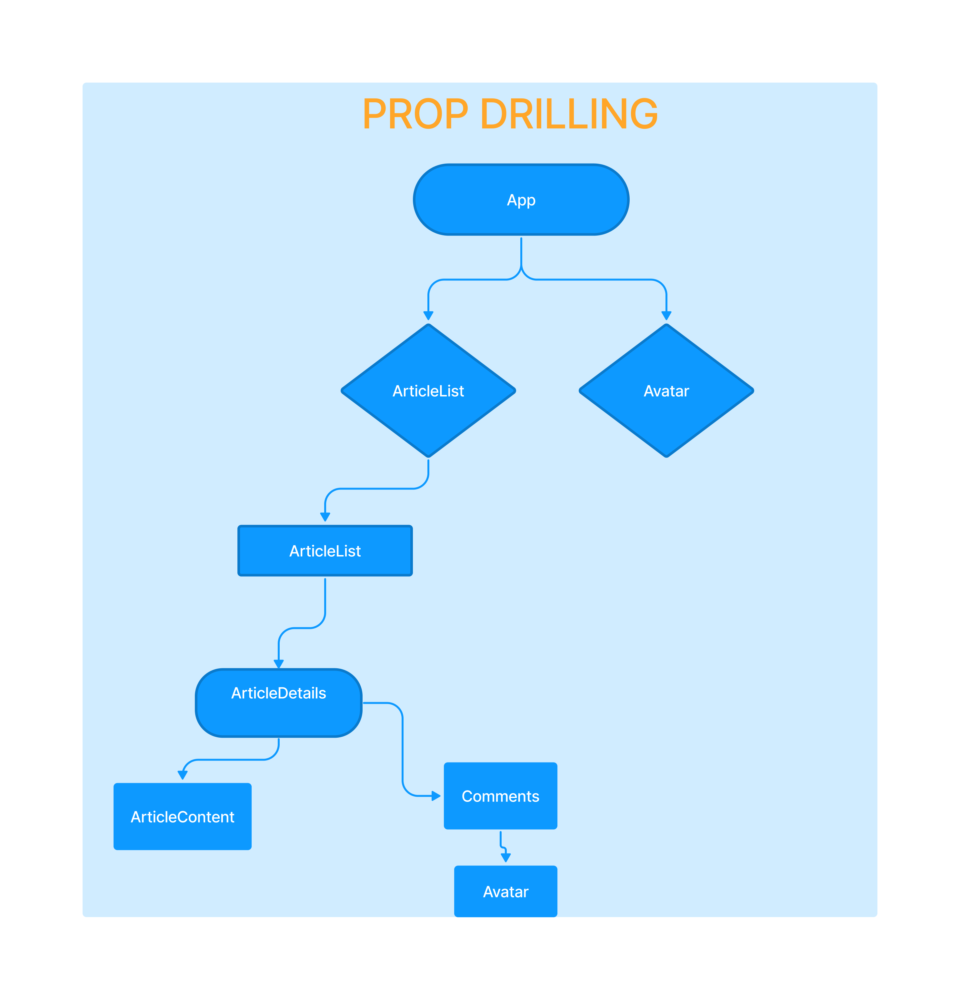
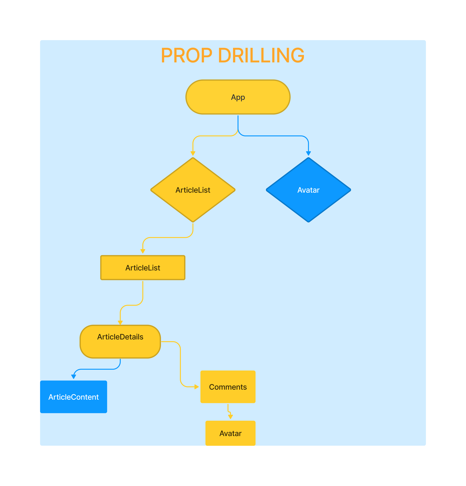

# Prop Drilling

We will start with recipe app and add some extra functionality to it. And for that we will use 2 new concepts _React Context Api_ and _Reducers_ but before we get into those two things, I want to demonstrate one of the reasons why we might use them.

So imagine we make the project, which is some kind of website where a user can log in and out on a web page in that site might be made up of several different components like this:

> Ignore prop drilling title i forgot to remove that

Then imagine we access the current logged in user of the site from the backend of the application inside this(in the image above) app components. And then we store that user in some kind of local state in that component.

Now we might need to use that information in the user avatar component over on the left side and at the very bottom to maybe show the user profile picture and their username.

So we'd be using that in two different places in the webpage:

> In the root App component where it might be in some kind of navbar.

> In the comments component down below.

Now, in the case of the avatar, in the top component, it's easy enough just to pass the user as a prop from the root App component into the avatar component so we can use it.

But in the case of the avatar down at the bottom at the bottom of the tree, it's more tricky. To get the user state to that component. We'd have to put it through the article list component, then the article details, then the comments component and finally the user component.

So we're passing the user state as a prop four levels deep here, and the user data isn't actually used in any of these other components that we're putting it down.
The only thing they're doing with that user state is putting it further down into the component tree as a prop each time around:

And this is what's known as prop drilling, where basically drilling a hole through all of our components just to pass a single prop down that we only use in one place at the end of the tree.

Now, in one sense, this is OK if it's just happening once or twice in your application. But as your project gets a bit more complex, the component tree expands. This pattern of prop drilling can get a bit more hard to update and keep maintenance. Now, one solution to this problem is to try and _**reduce**_ the number of components in the tree and only really break into new components when you need it. But if that's not possible, then another solution is to create a more global state using what's known as react _**context**_.