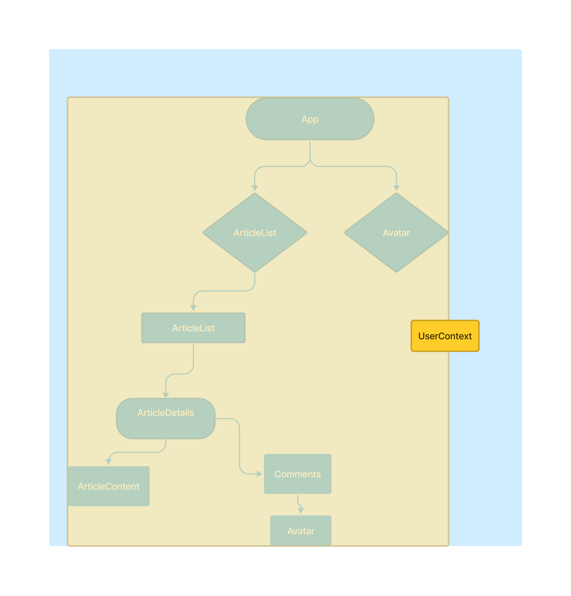
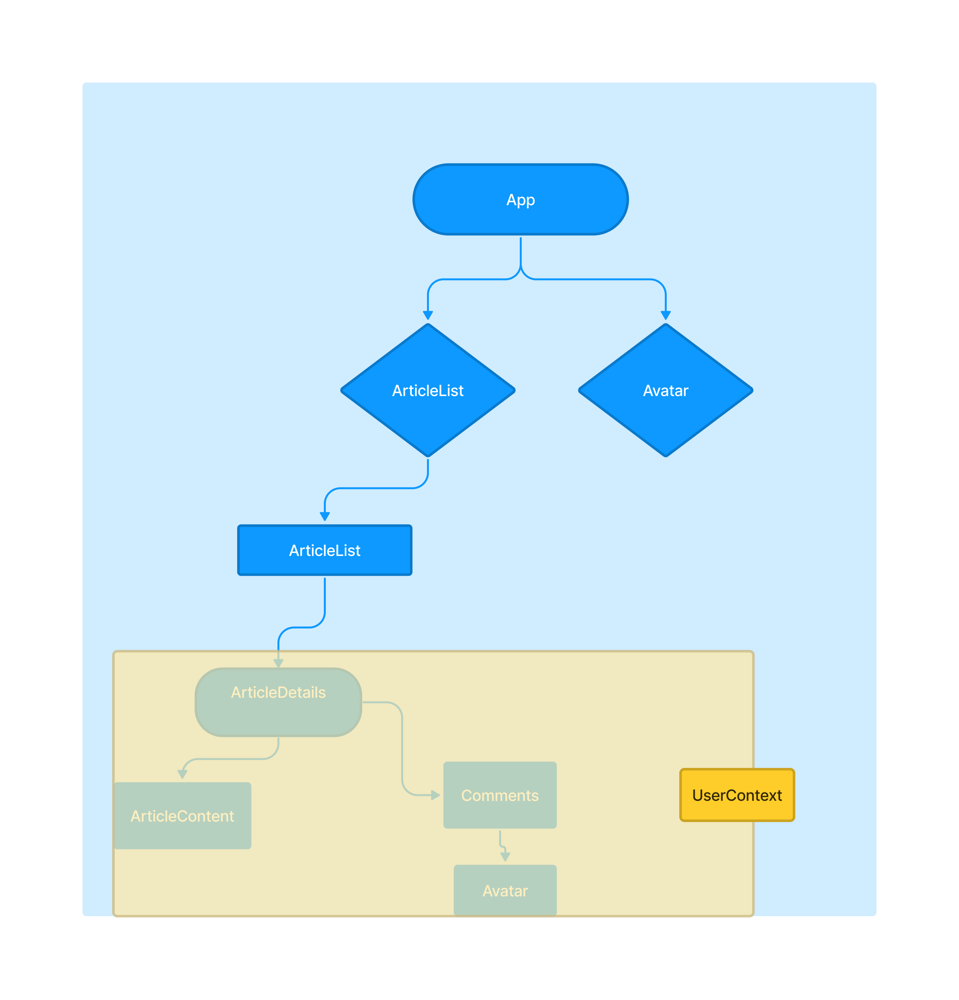

# What's Context API?

So we mentioned in the last md how we can create a kind of global state using react context. And this can help us to avoid prop drilling in some cases because it gives us a way to pass data into different components in a component tree without using props.

So what does context for us?

First is give us a central place of store. Like a shared data and then that context can be applied to any component tree in your application now.

It can surround the entire application, the whole component tree, if it contains state used all over your app in different components, and then any component in the application can access that data:

Or it can just wrap a smaller tree in your application if it's just shared data for that tree of components and then that tree of components can access that context data:

Instead of passing the user down all the way down through the tree of components to the one that it's used in, we can just wrap the whole tree of components in a user context.

And by doing this, we don't have to drill through all of our components to pass the user prop down through components which don't even need it.
Now, when we wrap a context around a trio of components, we don't actually wrap the context itself around them. Instead, we wrap what's known as a _context provider_, a component around them. And then this _context provider_ provides the tree with the global state value, and we're going to see exactly how that works in the next md.

## Word of warning when it comes to the context API.

Just because you can use global state, does it mean you always should?
Because using a lot of global state like this can lead to unnecessary component or renders, because any component that consumes a context will re render any time any data in that context changes.

So don't always reach for it right away.

And remember that a bit of prop drilling isn't always a bad thing.
It's only when you need to share some kind of global state in a number of different components that are nested at different levels in your component tree that you should reach for context.