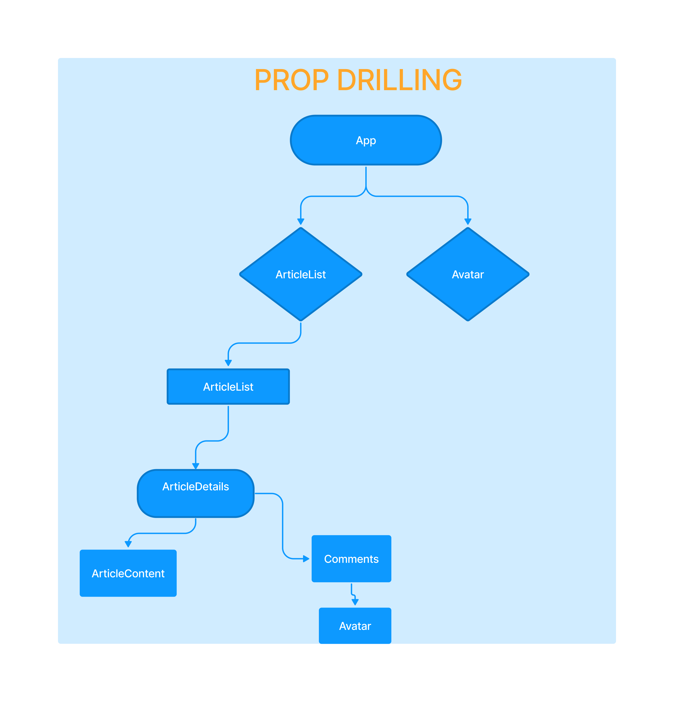

# Prop Drilling Intro

Wir beginnen mit einer **Rezept-App** und erweitern Sie mit extra Funktionalität.
Dafür werden wir diese beiden neuen Konzepte kennenlernen:

* **React Context Api**
* **Reducers**

Bevor wir diese beiden Konzepte angehen, lasst mich euch das anhand eines Beispiels näher bringen:

Stellen wir uns vor, wir haben eine Website, auf der sich ein User auf irgendeiner Page dieser Website ein- und ausloggen kann.

Die Website könnte aus verschiedenen Components, wie unten dargestellt, aufgebaut sein:

Führen wir den Gedanken fort und stellen uns vor, wir greifen aus dem Back-End des Components (*siehe oben*), auf dem sich der eingeloggte User gerade befindet, zu. Und dann speichern wir diesen User in einer Art lokalen Zustands in diesem Component ab, sprich im App-Component.

Schaut euch das Diagramm oben nochmal an. Die abgespeicherten Userdaten bräuchten wir nun womöglich im Avatar-Component rechts und ganz unten, um z.B. das Profilbild und den Namen des Users anzuzeigen.

Wir würden das also an zwei verschiedenen Stellen auf der Website verwenden:

>&nbsp;
> Im Root **App-Component**, z.B. in einer Nav-Bar.
> 
> Im **Comments-Component** weiter unten. 
> &nbsp;

Beim **Avatar-Component ganz oben** reicht es schon aus den **User als Prop** zu übergeben.

> &nbsp;
> *Also den User als Prop vom Root App-Component aus in das Avatar-Component hineinzugeben.*
> &nbsp;

Aber im Fall des **Avatar-Components ganz unten** im Diagramm ist die Sache komplizierter. Wir können den  
abgespeicherten **userState** nicht einfach direkt nach ganz unten geben. Stattdessen müssen wir den **userState** von *Component zu Component* leiten, bis wir ihn da haben, wo wir wollen:

>&nbsp;
> Ebene 0: **App** 
>> -> Ebene 1: **ArticleList**
>>> -> Ebene 2: **ArticleDetails**
>>>> -> Ebene 3: **Comments**
>>>>> -> Ebene 4: **Avatar**
>&nbsp;

Wir übergeben also den **userState als Prop, vier Ebenen tiefer**, jedoch wird, abgesehen von Avatar, in keinem einzigen der anderen Components davor *wirklich* benutzt. Anders gesagt, geben sie den **userState** als Prop an das Component eine Ebene tiefer weiter:

Dabei handelt es sich um das sogenannte **Prop-Drilling**, bei dem wir quasi ein Loch durch **alle unsere Components** bohren, um **ein einziges Prop** nach unten zu reichen, welches wir an **nur einer Stelle** auf der **untersten Ebene** verwenden.
  
In gewisser Weise ist das sogar okay, vorausgesetzt es kommt nur ein- bis zweimal in deiner Anwendung vor.

Bei größeren, komplizierteren Projekten, wächst die Anzahl der Components mitunter enorm. Es macht also wenig Sinn einzelne Props, die nur einen einzigen Zweck erfüllen, durch alle Components deines Projekts leiten zu müssen.

Außerdem ist das Updaten und die Maintenance von **Prop Drilling** etwas komplexer. 

Eine Lösung wäre, die Anzahl der Components im Baum zu ***reduzieren*** und nur bei Bedarf neue Components aufzubrechen. Wenn das nicht möglich ist, besteht eine andere Lösung darin, einen globaleren Zustand (global state) mit Hilfe von ***React-Context*** zu erstellen.
