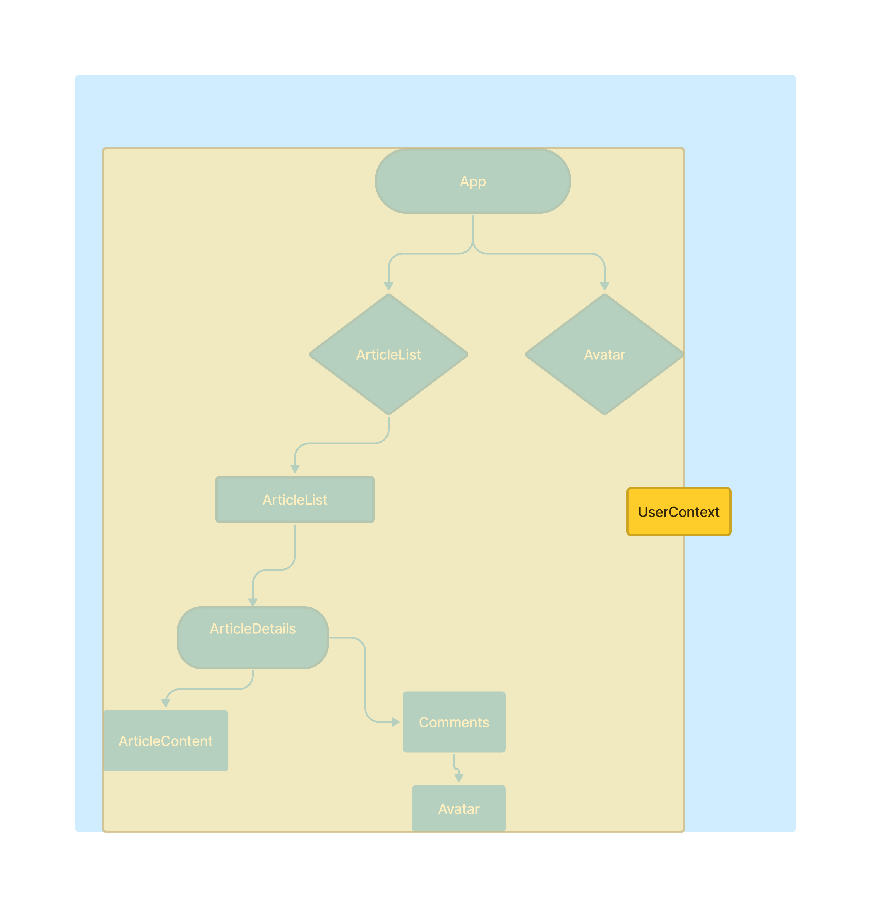
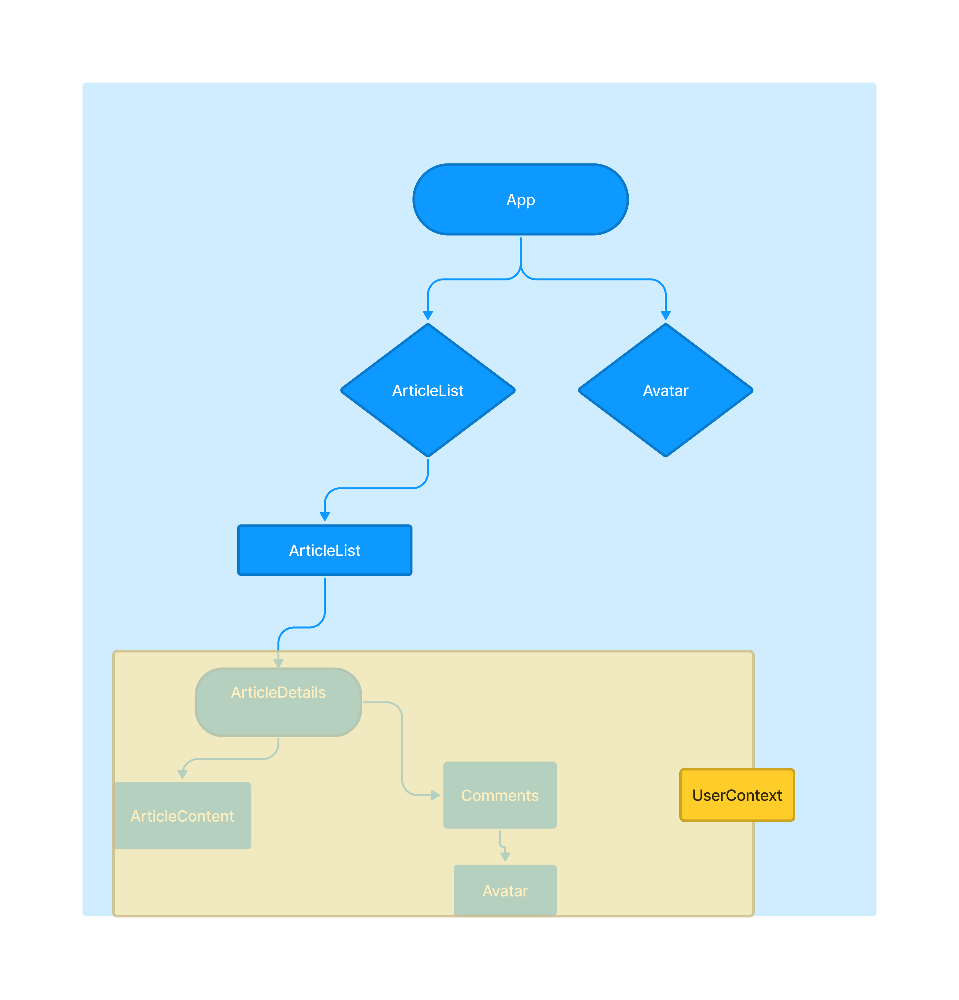
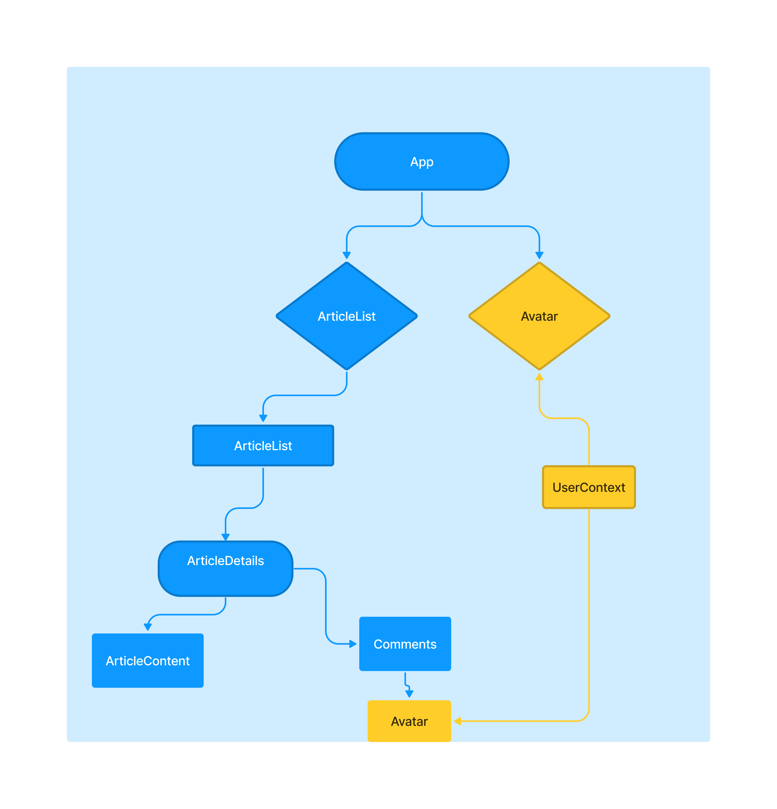

#  Was ist Context-API?

Im Intro haben wir erwähnt, wie wir mit **React-Context** ein **Global-State** erzeugen können. Und das kann uns helfen, **Prop Drilling** in einigen Fällen zu **vermeiden**, weil es uns einen Weg gibt, Daten innerhalb eines Component-Stammbaums an verschiedene Components zu übergeben, **ohne Props** verwenden zu müssen.
  
Was macht **React-Context** also für uns?

Es **zentralisiert unseren Speicherort** (gemeinschaftlich genutzte Daten). Der Kontext dessen kann jedem Component im Stammbaum hinzugefügt werden, wodurch die Daten für das Component sichtbar werden bzw. das Component Zugriff auf diese Daten gewährt bekommt. 

**Er kann die gesamte Anwendung (Application) und den gesamten Stammbaum**, sofern dieser einen State enthält, der überall in deiner Application innerhalb von Components verwendet wird, **umschließen (wrappen)**. Danach kann jedes Component auf diese Daten zugreifen.

Oder er **umfasst (wrappt) einfach einen kleineren Teil** des Component-Stammbaums. **Es entsteht also ein Kontext**.
Wenn es sich jetzt z.B. nur um gemeinsam genutzte Daten handelt, dann haben jetzt alle Components in diesem Kontext Zugriff auf diese Daten:

Anstatt den User den ganzen Weg nach unten bis Avatar zu jagen, können wir sogar einfach den **gesamten Baum in einen User-Context wrappen**.

Auf diese Weise müssen wir nicht alle Components durchbohren, und den **User-Prop** durch Components durchreichen, die ihn überhaupt nicht brauchen oder verwenden.

**Wenn wir nun ein Component-Trio mit React-Context umschließen, dann wrappen wir tatsächlich nicht den Kontext selbst um unsere Components!**

Sondern, wir wappen sie mit einem neuen Component, namens ***Context Provider***, der dem Baum einen globalen Zustandswert (a global state value) liefert.

In der nächsten Readme sehen wir, wie das genau funktioniert.

##  Ein Wort der Warnung, wenn es um Context-API geht:

Nur weil du ein globales State verwenden kannst, heißt das nicht, dass du das auch immer tun solltest!

Denn die Verwendung vieler soclher States kann zu unnötigen Components oder Renders führen, da jedes Component, das einen Kontext verbraucht, jedes Mal neu gerendert wird, wenn sich Daten innerhalb des Kontexts ändern.

Greift also nicht immer gleich danach. 👺

Und denkt daran, dass ein bisschen Prop Drilling nicht immer etwas Schlechtes ist. 🧐

Nur wenn du einen globalen State, einer Reihe verschiedener Components zuweisen musst, die auf verschiedenen Ebenen in deinem Component-Stammbaum verschachtelt sind, solltest du nach React-Context greifen.
