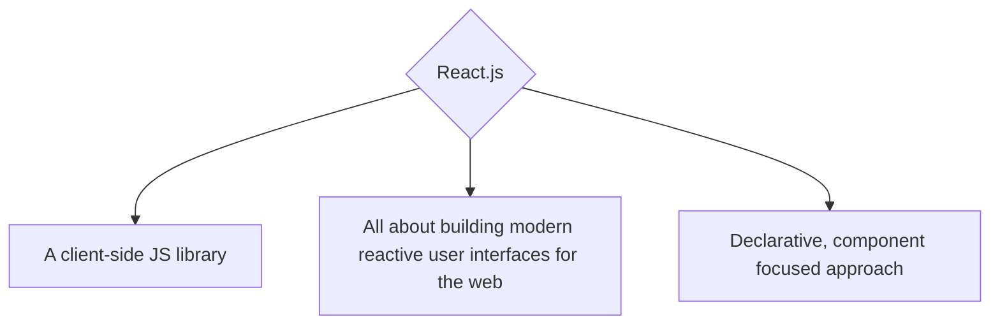
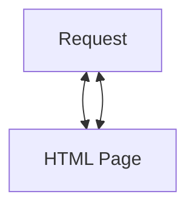

# Module Content

## What is React? And Why?

## Core Concepts: Components, Props, State

## Advanced Concepts: Hooks


# What is React? And Why would we use it?

## Regarding the what
https://reactjs.org/

here we learn that React is a JavaScript **LIBRARY**
and it's a Javascript library for building user interfaces.

Lean and focused component based UI library. Certain features (e.g routing) are added via community packages.

## Library vs Framework

A library is a collection of pre-written code that can be used to perform specific tasks. It is intended to be used as a tool to perform those tasks and is typically called from within a larger program. A framework, on the other hand, is a collection of pre-written code that defines a structure for developing a specific type of application. It provides a set of conventions for building and organizing the code, and the developer is expected to work within that structure.

## Regarding the why


Netflix for example is built with React.
If we add a show to our list and go to My List the refresh button will never spin. Why? Because we never request a new HTML Page, we never have to wait for a new HTML Page to be generated by the server.
It's very similar to mobile Apps. When we use mobile apps we are used to things being very "reactive".

Reactive: Things happen instantly, you don't wait for new pages to load or actions to start.

Traditionally in web apps, you click a link and wait for a new page to load. You clikck a button and wait for some action to complete.




# Alternatives

## Angular, React.js & Vue

Angular, React and Vue are all highly popular JavaScript libraries and frameworks that help developers build complex, reactive and modern user interfaces for the web. Actually, with additional libraries like React Native, Ionic (with Angular or with React) or NativeScript you can even build native mobile apps for mobile devices with help of Angular, React and Vue.


# Framework Backgrounds

Some background first:
### Angular
    Angular is a framework developed by Google: Google also uses Angular internally, hence we'll not see Angular disappear over night. It will be maintained and continuously improved
### React
    React is a library built by Facebook: Facebook also uses React internally, hence we'll not see React disappear over night. It will be maintained and continuously improved
### Vue
    Vue is a "standalone" project that is not built inside of any company. It used to be a one-man show (Evan You, its founder) but those days are long gone. Nowadays, it has a dedicated team of core contributors that work on Vue.


# Comparing Syntax

## Angular

Angular projects use TypeScript, which is a superset (i.e. an addition) to JavaScript. TypeScript doesn't run in the browser but Angular projects include tools that will compile the TypeScript code down to browser-compatible JavaScript code under the hood.

A typical Angular code snippet would look like this:

```ts

import { Component, Input, Output, EventEmitter } from '@angular/core'

@Component({
  selector: 'app-user-list',
  template: `
    <ul>
      <li *ngFor="let user of users" (click)="onSelectUser(user.id)">
        {{ user.name }}
      </li>
    </ul>
  `,
})
export class UserListComponent {
  @Output() selectUser = new EventEmitter<{ id: string; name: string }>()
  @Inout() users: { id: string; name: string }[]

  onSelectUser(id: string) {
    this.selectUser.emit(this.users.find(u => u.id === id))
  }
}

```

# React

Let's explore a similar code snippet in React:
React typically uses JavaScript (though you also can use it with TypeScript) and it uses a special JavaScript "feature" which is called "JSX".

JSX isn't really part of the JavaScript language, React projects just are set up such that this "HTML in JavaScript" syntax is supported during development. Just like with TypeScript in Angular projects, JSX gets compiled to regular, browser-friendly JavaScript code behind the scenes once you build your project.

```jsx
import React from 'react'

export function UserList(props) {
  function userSelectHandler(userId) {
    props.onSelectUser(props.users.find(u => u.id === userId))
  }

  return (
    <ul>
      {props.users.map(user => (
        <li key={user.id} onClick={userSelectHandler.bind(null, user.id)}>
          {user.name}
        </li>
      ))}
    </ul>
  )
}
```

# Vue
Let's now have a look at the same component implemented in Vue:

```js
<template>
  <ul>
    <li v-for="user in users" :key="user.id" @click="selectUser(user.id)">
      {{ user.name }}
    </li>
  </ul>
</template>
<script>
  export default {
    props: ['users'],
    methods: {
      selectUser: function(userId) {
        this.$emit(
          'selectUser',
          this.users.find(u => u.id === userId)
        )
      },
    },
  }
</script>
```

Vue uses regular JavaScript (though, optionally, you can also use TypeScript) and it typically utilizes something which is called "Single File Components". It is a framework all about components after all (just like the other two) but like Angular, it splits template (i.e. HTML) and JavaScript logic apart.

Vue also has support for JSX but in the vast majority of projects, you'll see code as written above.

This separation can be a bit easier to grasp for newcomers (similar to Angular) since we don't mix JavaScript with HTML here. But that's of course something highly individual.

## React Ecosystem

React Native, Expo framework, Gatsby, Nextjs

## DOM vs Virtual DOM

The DOM (Document Object Model) is a tree-like representation of an HTML or XML document, used by web browsers to understand and manipulate a web page's structure and content. The virtual DOM is a lightweight version of the actual DOM, used by libraries like React to improve the performance of web applications by minimizing the amount of changes made to the actual DOM. When a change is made to the virtual DOM, it is compared to the actual DOM to determine the minimal set of changes that need to be made to the actual DOM, resulting in faster updates and better performance.
It's hard to give a specific percentage as the performance improvement of using a virtual DOM can vary depending on the specific use case and the complexity of the application. However, in general, using a virtual DOM can significantly improve the performance of web applications, particularly those with large amounts of dynamic content or complex user interactions.

Virtual DOM allows to update only the necessary parts of the UI which reduces the number of DOM operations thus making it faster than updating the whole DOM. Additionally, because it keeps a copy of the previous state of the UI and it only updates the differences, it provides more efficient updates.

In some cases, the performance improvement can be substantial, with reductions in the time needed to update the DOM by as much as 90% or more.

## TL;DR

React is a JavaScript library for building user interfaces. It allows developers to create reusable UI components and manage the state of their application in an efficient way, making it easier to build and maintain large-scale web and mobile applications. React uses a virtual DOM to improve performance by minimizing the amount of changes made to the actual DOM.

