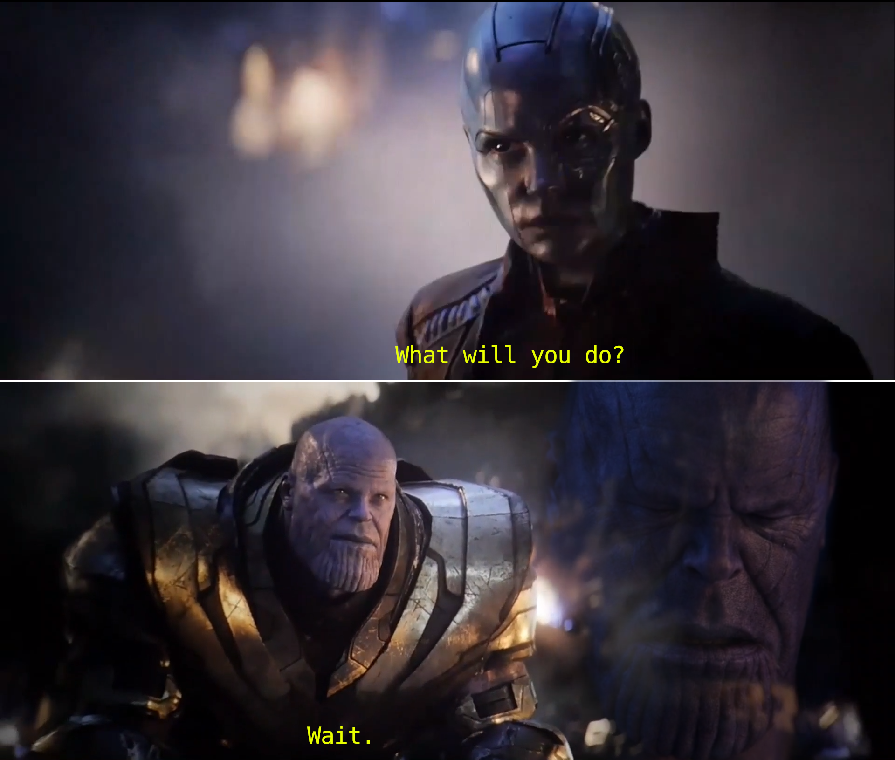

# What is Firebase?

We're at the point where hopefully you're starting to feel a bit more comfortable with react and creating react projects.

We've looked at state hooks custom hooks, the react router and the context API, as well as other things like reducers.

But so far, we've always been using local data, whether that's stored in some kind of state in the application itself or inside json file.

But in reality, you'll no doubt need to work with a database to store and organize your data in.

Since we didn't start with backend yet i would still like y'all to try real life examples, so what's the best way to do it with minimum backend knowledge ? That's right free to use Google [Firebase](https://firebase.google.com/).

Firebase also provides us with other free services as well, such as an authentication service and a file storage service. It bundles all of these different features together into one product, Firebase, and so it essentially acts as the backend of our websites. And that's great for us as front-end developers because it means we don't have to worry too much about setting up our own server or creating our own API to interact with data or implement our own authentication solution, etc.

Firebase handles all of that heavy lifting for us, and we can just plug in that functionality into our project.

First of all, and sign up for a free account.

And then once you have an account, you'll see this go to console link, so click on that to go to your Firebase console.

Now, your Firebase console is basically a place that lists all of your different Firebase projects that you've created and typically, for every completely different website you make, you'll have a new Firebase project to power the backend of that website.

But a Firebase project can be used for multiple fronts and sites as well.

For example, I might have a website and a mobile app. Both of those could use the same backend Firebase project because they're probably use the same data and share the same uses.

So what I'm going to do now is create a new project and we're going to call this El Cook site and then click on Continue.

Now it's going to ask us if we want to enable Google Analytics for the project.

We don't need that. so click it off

Click on Continue.

And that's going to take us to our project dashboard.

So it's on this dashboard(sidenav) that we can see all the different features and services available to us, like authentication, firestore database and a real time database. Storage, hosting functions, machine learning, etc. and loads of other things down here as well that we can take a look at.

So this project dashboard is like a control center for this Firebase project that we've set up that is now going to act as a backend to our React application.

FYI: When you're readin this in the future, the UI or design of this might be slightly different, but generally the functionality of it is going to be pretty much the same. So read the mf docs