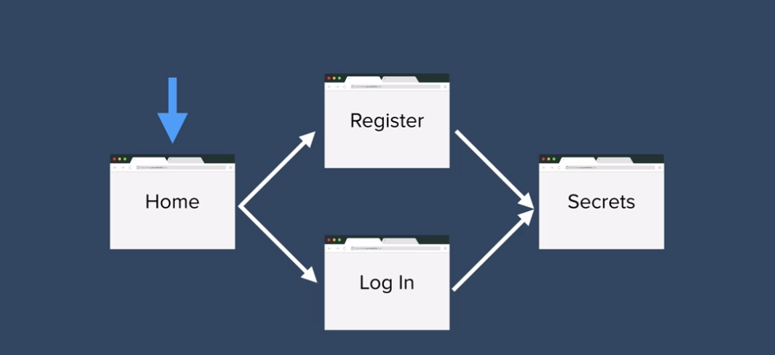

# Introduction to Authentication

This time we're going to tackle the topic of authentication. And it's something that is often thought of as incredibly complicated but it doesn't have to be. And we're going to take it step by step from beginning to end so that you get an overview of the entire process of setting up authentication from scratch.

## So why do we need to authenticate?

Well, as we're creating our website or web app for users to use then these users are going to start generating data in the website. They might like certain posts, they might interact with other users, there might be messages created or recipes created. There's always going to be some user data created. And in order to associate those pieces of data with individual users, we need to create an account for each user so that they would sign up to our website using a username and password and we would essentially create kind of like an ID card for them to uniquely identify them on our database and to save all of the data that they generate onto that account. So the next time that they come back onto the website they'll be able to use their username and password and log into our website and be able to access all of those possibly private pieces of information. So this way you don't end up with everybody being able to see you know what private messages you're sending around on Facebook or see your direct messages on Twitter.

So that's pretty simple.

Now the other reason why you might want to add authentication to your website is to restrict access to certain areas of the website depending on the status of the user. So for example if you were Spotify or Netflix and you charge a subscription for accessing certain parts of the website then once the user pays, you have to update their account in your database to say that they have paid and they'll be allowed to access the TV shows or songs that they're entitled to.

So those are some of the reasons why you might want to add authentication to your website. But authentication can be done in a number of ways. Creating a website where we sign up and login users seems simple enough but the difficult part of authentication comes from how secure you're going to make your website. And we're going to tackle this problem of authentication by going through the different levels of security. So we're going to go from very basic creating an account, adding the user to our database, saving their username and password to enable them to log in, all the way up to covering things such as OAuth and social logins including creating things such as sessions and cookies and hashing and encrypting passwords. And it's going to be more than you'd ever want to know about this topic but it's really really important that you learn it in the beginning because later on once you've understood and you've built authentication from the bottom up then I'm going to show you some ways of simplifying and making your life easier using third party libraries like Passport. So we're going to learn how to progress from essentially a website that's basically secured with a chito

 to something that is a lot more serious and more consistent with industry standards of good security on a website.

So there is a app called Whisper that you might have come across and it's a really simple concept basically allows people to submit their secrets anonymously. So whatever they post are not associated with a email or a user name and it means that people can express themselves I guess more freely. and this is what we're going to try and replicate. So the structure of our website is really really simple. It has a home page which has two buttons that allows you to either go towards register or go towards log in and once the user has been registered or logged in and they have been authenticated then they are able to access the secrets page.

So I've kept the remainder of the website pretty simple because we're going to be focusing on a pretty complex topic so that we can focus our efforts on learning authentication and not get distracted by things like Bootstrap and styling.