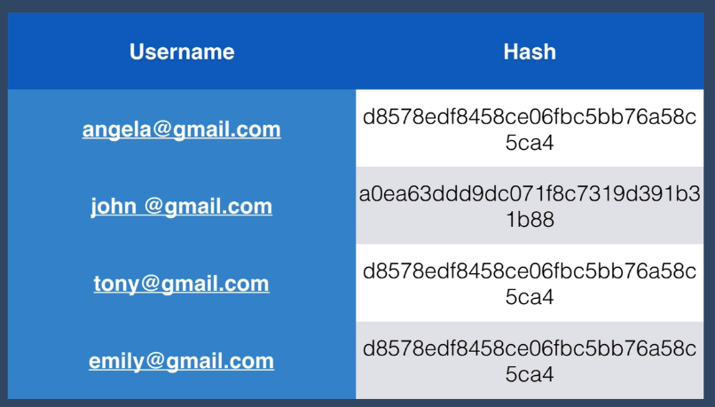
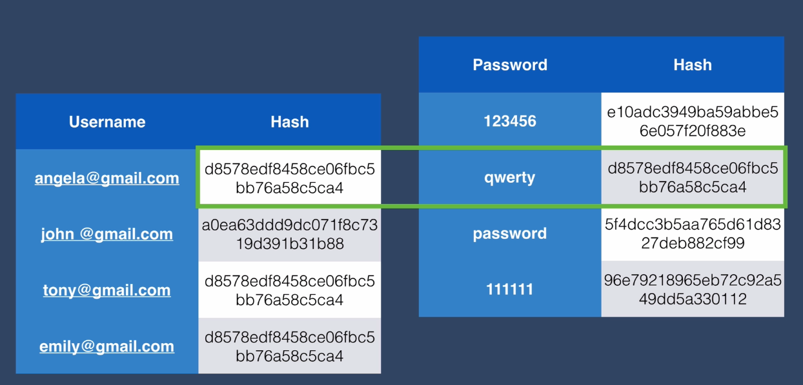
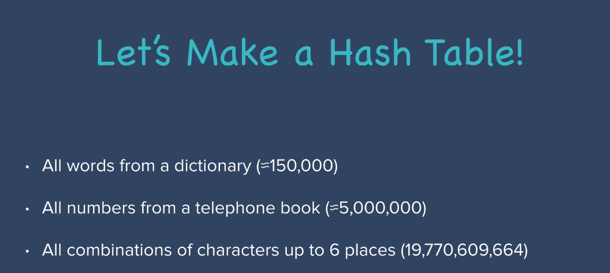

# Hacking 101

Nachdem wir uns nun mit der Erstellung von Benutzerpasswörtern, der Verschlüsselung unserer Datenbank und dem Hashing von Passwörtern beschäftigt haben, haben wir sozusagen ein Sicherheitsniveau erreicht, auf dem sich die meisten Websites befinden. Jetzt gibt es noch viel mehr Sicherheit, über die wir später noch ein wenig lernen werden. Aber Sie sind jetzt an einem Punkt, an dem Sie bereits eine Menge über Authentifizierung und die Sicherheit von Benutzerpasswörtern wissen, und definitiv viel mehr als viele Leute, die Websites betreiben.

[go to](https://plaintextoffenders.com/)
Aber hier finden Sie E-Mails von verschiedenen Unternehmen, in denen der Benutzer aufgefordert wird, sein Kennwort zurückzusetzen, und sie senden dem Benutzer eine Klartextversion seines Kennworts. Jetzt wissen wir, dass es möglich ist, das Passwort des Benutzers im Klartext zu erhalten, was bedeutet, dass sie die Passwörter auf schreckliche Art und Weise sichern. Entweder ist es verschlüsselt und es gibt irgendwo einen Verschlüsselungsschlüssel, den sie speichern, oder es ist einfach nur als Klartext in ihrer Datenbank gespeichert, was die schlechteste Art von Sicherheit ist. Wenn Sie also schon viel besser Bescheid wissen als die Leute, die eines dieser Unternehmen leiten, dann könnten Sie in Ihrem Lebenslauf damit prahlen oder einfach eine E-Mail an diese Leute schreiben und ihnen sagen: "Ich bin Webentwickler und kenne mich mit Authentifizierung und sicheren Benutzerpasswörtern aus. Sie scheinen offensichtlich etwas Hilfe zu brauchen. Möchten Sie, dass ich für Sie arbeite?"
Wenn Sie bei einem dieser Anbieter angemeldet sind, sollten Sie Ihr Konto löschen, denn es ist definitiv nicht sicher. Und das ist der Grund, warum viele Unternehmen und Websites gehackt werden, weil sie nicht über diesen Punkt hinausgehen. Es ist also ein wirklich guter Zeitpunkt, um darüber zu sprechen, wie Passwörter gehackt werden. Also eine Art Lektion über das Hacken von Passwörtern, wenn Sie so wollen. Meistens setze ich meine Programmierfähigkeiten für gute Zwecke ein, aber in diesem Fall möchte ich darüber sprechen, wie Passwörter gehackt werden können, damit wir, sobald wir verstehen, wie die andere Seite an dieses Problem herangeht, mehr über Sicherheit lernen und unsere Website für die Benutzer sicherer machen können. Übrigens, ich habe keine Ahnung, warum Hacker immer mit einer Sturmhaube oder einer anonymen Maske dargestellt werden. Es muss unglaublich warm sein, wenn sie mit Kapuzenpulli und Sturmhaube/Maske im Gesicht neben allen Computern/Bildschirmen sitzen. Als Unternehmen freuen Sie sich wahrscheinlich am wenigsten auf den Tag, an dem Sie aufwachen und einen Anruf erhalten, dass Sie gehackt worden sind. Und das ist vielen großen Unternehmen schon oft passiert, z. B. Adobe Creative Cloud wurde 2013 gehackt, LinkedIn wurde 2012 gehackt, und bei vielen Konten sind Passwörter geleakt worden. Viele unzufriedene Nutzer, die ihre Passwörter wiederverwenden und sich extrem verletzlich fühlen. Und selbst heute noch können Menschen diese gehackten Konten kaufen, ohne zu wissen, dass ihre LinkedIn-E-Mail und ihre Passwörter miteinander verknüpft sind, und diese Daten kaufen und nutzen, um sich in ihre PayPal-Konten oder andere ähnliche Zahlungsportale einzuhacken. Selbst wenn Sie aus dieser Lektion nichts lernen, empfehle ich Ihnen, einfach auf [diese Website](https://haveibeenpwned.com/) zu gehen, aber geben Sie es in Ihre E-Mail-Adresse ein und stellen Sie sicher, dass Sie, falls Passwörter auftauchen, alle Orte ändern, an denen Sie dieses Passwort verwenden. Aber warum werden all diese großen Unternehmen gehackt und geben die Passwörter ihrer Benutzer preis? Verschlüsseln sie nicht wenigstens ihre Passwörter oder hacken sie?

Nun, sie tun es. Aber bedenken Sie Folgendes. Sie sind also ein Hacker und haben es geschafft, in die Benutzerdatenbank von LinkedIn einzudringen. Der Einfachheit halber nehmen wir an, sie sieht so aus. Sie haben einen Benutzernamen und einen Hash. Und zum Glück haben sie die Passwörter ihrer Nutzer nicht im Klartext gespeichert.

Sie können nicht direkt auf die Passwörter zugreifen. Wenn Sie sich diese Tabelle jedoch etwas genauer ansehen, werden Sie feststellen, dass drei der Hashes völlig identisch sind. Woran mag das liegen? Denken Sie daran, dass ein und dasselbe Passwort immer denselben Hash ergibt, egal wie oft Sie es versuchen. Und das ist ein wesentlicher Bestandteil der Hash-Funktion, auf die wir uns auch bei der Überprüfung unserer Benutzer verlassen. Das heißt, ein Hacker würde sich diese Tabelle ansehen und feststellen, dass Angela, Tony und Emily alle dasselbe Passwort haben. Und er kann damit beginnen, eine so genannte Hash-Tabelle zu konstruieren. Sie würden also einige der am häufigsten verwendeten Kennwörter nehmen und dieselbe Hash-Funktion verwenden, um den Hash-Wert für jedes dieser Kennwörter zu erstellen. Und das sind einige der am häufigsten verwendeten Passwörter, die die Leute gerne benutzen. 123456, qwerty, Passwort, 111111. Sie erzeugen also diese Hash-Tabelle und müssen dann nur noch den Hash-Wert des Benutzers nachschlagen und mit dem Hash-Wert in Ihrer Tabelle vergleichen. Sie suchen also nach dem Hash-Wert. Und Sie landen bei dem Passwort, das qwerty lautet.

Sie haben also herausgefunden, dass drei von vier Benutzern in dieser Tabelle das gleiche Passwort haben, und zwar qwerty.

Was aber, wenn sie nicht eines der gebräuchlichsten Passwörter verwenden, sondern etwas anderes, z. B. ihr Geburtsdatum oder den Namen ihres Haustiers? Schauen wir uns einmal an, wie wir als Hacker eine Hashtabelle erstellen würden. Sie würden wahrscheinlich mit allen Wörtern aus einem Wörterbuch beginnen. Daher kommt auch der Begriff Wörterbuchangriff. Man erstellt Hashes aus allen möglichen Wörtern in einem Wörterbuch, und das sind nur etwa 150000 Hashes, die man erstellen müsste. Dann fügt man zu dieser Hash-Tabelle alle Zahlen aus einem Telefonbuch und alle Zeichenkombinationen bis zu sechs Stellen hinzu. Und wenn man das alles zusammenzählt, kommt man auf etwa 19,8 Milliarden Kombinationen, was zugegebenermaßen nach einer großen Zahl klingt, oder?

Wie lange würde Ihr Computer brauchen, um so viele Hashes zu berechnen?

Und was tun wir jetzt?

Nun, wir gehen einkaufen. Kaufen wir einige der neuesten Grafikkarten, die parallel arbeiten können und daher nicht nur für das Bitcoin-Mining, sondern auch für die Erstellung von Hashes besonders geeignet sind. Mit einer der neuesten GPUs kann man etwa 20 Milliarden MD5-Caches pro Sekunde berechnen. Das bedeutet also, dass eine dieser GPUs für unsere Hash-Tabelle mit 19,8 Milliarden Kombinationen nur 0,9 Sekunden braucht, was nichts ist. Das ist nicht viel Zeit, die man investieren muss, um die Kennwörter so vieler Menschen zu hacken. Und um es noch schlimmer zu machen, wurden große Hash-Tabellen für die [häufigsten Passwörter](https://en.wikipedia.org/wiki/List_of_the_most_common_passwords) erstellt. Da wir so viele Daten aus früheren Hacks wie dem von Adobe, LinkedIn, TalkTalk oder Equifax haben, wissen wir, welche [häufigsten Passwörter](https://www.passwordrandom.com/most-popular-passwords) die Leute verwenden. Und jedes Jahr stellen Unternehmen wie Splash Data die häufigsten Passwörter zusammen, sagen wir die Top 25. Und von dort stammen all diese Werte, die in unsere Tabelle eingeflossen sind. Aber man kann sogar noch einen Schritt weiter gehen. Es gibt vorgefertigte Hash-Tabellen, die für die 10.000 häufigsten Kennwörter erstellt wurden. Sie sehen, dass MD5 einer der am schnellsten zu berechnenden Hashes ist, und deshalb findet man häufig MD5-Hashtabellen, und Sie können sogar Google als einfache Hashtabelle verwenden. Sie können den Hash, den Sie in der gehackten Datenbank gefunden haben, einfügen, eine einfache Google-Suche durchführen und schon haben Sie das ursprüngliche Passwort.

Wenn Sie jetzt extrem verängstigt sind und sich fragen, was genau können Sie dagegen tun?

Stellen Sie sich vor, in unserer Benutzertabelle gab es einen Hash, der extrem schwer zu finden war und mit keinem der Hashes in dieser kleinen, einfachen Hash-Tabelle, die wir erstellt haben, übereinstimmte.

Was wäre also, wenn wir das in Google eingeben, um in größerem Umfang zu suchen und zu sehen, ob es mit einem der Hashes in den Hash-Tabellen übereinstimmt, die andere Leute erstellt haben. Und das tut sie nicht. Sie stimmt mit nichts überein. Der Grund dafür ist, dass John bei der Erstellung seines Passworts ein sehr starkes Passwort mit Großbuchstaben, Kleinbuchstaben, Zahlen, Symbolen und vor allem einem langen Passwort verwendet hat. Wenn Sie sich Hashing als mathematische Formel vorstellen, werden Sie feststellen, dass die Rechenzeit, die zum Knacken des Passworts erforderlich ist, mit der Anzahl der Zeichen exponentiell ansteigt. Es spielt also keine Rolle, ob Ihr Konto bei LinkedIn oder Adobe Creative Cloud oder Ashley Manson geknackt wurde, solange Sie ein starkes Passwort haben, können sie es nicht aus einer Hash-Tabelle herausfinden. Auf der Website [Password checker](http://password-checker.online-domain-tools.com/) können Sie beispielsweise Ihr Passwort eingeben, und es wird Ihnen nicht nur die Stärke des Passworts angezeigt, sondern auch, wie lange verschiedene Arten von Maschinen brauchen, um das Passwort zu knacken. Obwohl alle Websites Sie dazu auffordern, einen Großbuchstaben, einen Kleinbuchstaben, einige Zahlen und einige zufällige Zeichen hinzuzufügen, dauert es bei einem kurzen Passwort mit nur sechs Zeichen nicht sehr lange, bis es geknackt ist. Das Wichtigste bei der Erstellung eines sicheren, fast unknackbaren Passworts ist also, die Anzahl der Zeichen zu erhöhen. Und um zu verhindern, dass Sie Opfer eines Wörterbuchangriffs werden, stellen Sie sicher, dass Sie kein Wörterbuchwort oder einen Ortsnamen oder etwas, das irgendwo in einem Verzeichnis steht, wie eine Telefonnummer, verwenden. Nach dieser Lektion wissen Sie also zumindest, wie Sie sich sicherer machen können. In der nächsten Sicherheitsebene werden wir uns mit den Schwachstellen befassen, die durch schwache Hash-Algorithmen entstehen, und wir werden lernen, wie wir Hacker bekämpfen können, die versuchen, unsere Datenbank mit einem Wörterbuchangriff oder durch die Erstellung einer Hash-Tabelle anzugreifen. Als kleinen Bonus empfehle ich Ihnen, wenn Sie Ihren Freunden vorgaukeln wollen, dass Sie eine Art Hacker sind, zumindest laut Hollywood, eine Website namens [hackertyper.net](https://hackertyper.net/), auf der Sie einfach auf die Tastatur drücken können und am Ende Folgendes erhalten
Aber ein Wort der Warnung: Versuchen Sie nicht, dies in einem Flugzeug oder in einem Regierungsgebäude zu tun, es sei denn, Sie wollen tatsächlich untersucht werden.