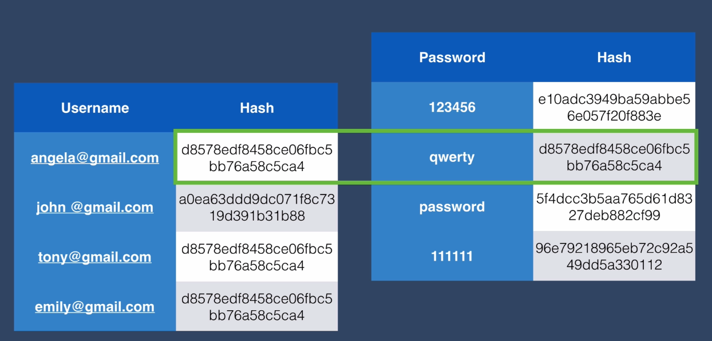
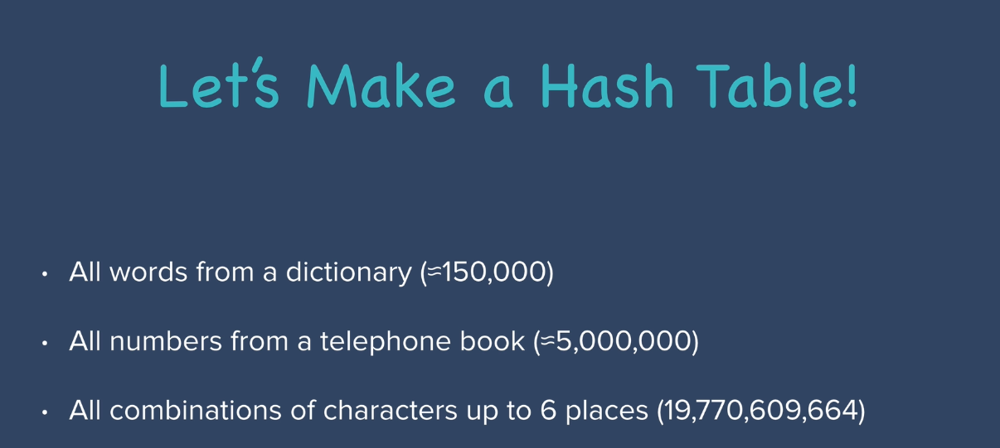

# Hacking 101

So now that we've covered creating user passwords encrypting our database as well as hashing passwords, we've kind of reached a level of security that most websites are at. Now there's a lot more security that we're going to learn about a little bit later on. But you're actually at a point where you already know quite a lot about authentication and keeping user passwords secure and definitely a lot more than a lot of people who actually run websites.

[go to](https://plaintextoffenders.com/)
But here what you'll find is emails that come from various companies where the user's requested to reset their password and they're sending the user a plain text version of their password. Now at this point we know to be able to even get the user's password in plaintext it means that they're doing some horrible things with securing the passwords. Either it's encrypted and there's an encryption key somewhere that they're storing or it's simply just stored on their database as plain text which is the worst possible type of security. So given that you already know a lot better than the people who run one of these companies, then you could brag about it in your resume or actually just email these people and tell them that "I'm a web developer and I know about authentication and securing users passwords. You obviously seem like you might need some help. Would you like me to work for you?"
If you're signed up to any of them be sure to delete your account because it's definitely not secure. And this is why a lot of companies and a lot of websites get hacked because they don't continue beyond this point. So that means it's a really good time to talk to you about how passwords are hacked. So a sort of hacking passwords 101 lesson if you will. Now most of time We use my programming powers for good but in this case I want to talk to you about how passwords might be hacked so that once we understand how the other side approaches this problem then we can learn more about security and make our website safer for users. And by the way, I have no idea why hackers are always portrayed in a balaclava or anonymous mask. Must be incredibly warm sitting next to all computers / screens wearing hoodies and baclava/ mask on their face. So, as a company, this is probably one of the things that you least look forward to the day when you wake up and you get a call and you've been hacked. And this has happened really often to a lot of big companies like Adobe Creative Cloud got hacked in 2013, LinkedIn got hacked in 2012 and there's loads of accounts where their passwords get leaked. Lots of unhappy users who reuse their passwords and are feeling extremely vulnerable. And you can see that even to this day people can purchase these hacked accounts where people might not have realized that their LinkedIn email and their passwords are linked and people are potentially buying that data up and using it to hack into their PayPal accounts or other similar payment portals. So even if you don't learn anything from this lesson, I recommend just going to [this website](https://haveibeenpwned.com/), But put it in your email address and make sure that if you do have any passwords that show up, change all the places where you use that password. But why is it that all of these big companies are getting hacked and leaking their users passwords? Are they not at least encrypting or hashing their passwords?

Well they are. But consider this. So you're a hacker and you've managed to get in to the LinkedIn user database. And just for simplicity's sake, let's say it looks like this. You've got a username and you've got a hash. And thankfully they didn't store their users passwords in plain text.

You can't access their passwords straight away. However, if you look at this table a little bit more closely you will realize that three of the hashes are completely identical. Now why might that be? Well remember that the same password always turns into the same hash no matter how often you try it. And that's a core part of the hash function that we rely on in order to validate our users as well. So that means a hacker would look at this table and realize that Angela, Tony and Emily all have the same password. And what they can do is they can start to construct what we call a hash table. So you would take some of the most commonly used passwords and you would use the same hash function to create the hash value for each of those. And these are some of the most common passwords that people love to use. 123456, qwerty, password, 111111. And so you generate this hash table and then all you have to do is just look up the hash of the user and compare it against the hash you have in your table. So you search by the hash value. And you land upon the password which is qwerty.

So now you figured out that three out of four users in this table all have the same password and it's qwerty.

So what if they didn't use one of the most common passwords and instead they use something else, say their date of birth or that pet's name? Well let's see how we would make a hash table if we were a hacker. You would probably start with all the words from a dictionary. And this is where the term dictionary attack comes from. You create hashes from all the possible words in a dictionary and that will only be about 150000 hashes that you would need to create. And then you add to that hash table all the numbers from a telephone book and all the combinations of characters up to six places. And then you add all of these together and you end up with something close to 19.8 billion combinations which admittedly sounds like a large number right?

How long would it take your computer to calculate that many hashes?

So what do we do?

Well, let's go shopping. Let's go and buy some of the latest GPUs or graphics cards which are capable of parallel processing and therefore are particularly suited to not only bitcoin mining but also generating hashes. With one of the latest GPUs, you can calculate about 20 billion MD5 caches per second. So that means with our hash table of 19.8 billion combinations, it'll only take one of these GPUs 0.9 seconds which is nothing. It's not a lot of time to invest in order to hash so many people's passwords. And to make it even worse, large hash tables have been built for the [most common passwords](https://en.wikipedia.org/wiki/List_of_the_most_common_passwords). So because we've had so much data from previous hacks such as the Adobe one or the LinkedIn one or TalkTalk or Equifax, we know what the [most common passwords](https://www.passwordrandom.com/most-popular-passwords) are that people use. And every year companies like Splash Data will compile what are the most common passwords say the top 25. And this is where all of those values that went into our table came from. But you can actually go one step further. There are pre-built hash tables that people have created for the top 10,000 most common passwords. And you can see that MD5 is one of the quickest hashes to calculate and this is why it's very very common to find MD5 hash tables and you can even use Google as a basic hash table. You can paste in the hash that you found from the hacked database, you perform a simple google search and you come up with the original password.

Now if at this point you're extremely scared and you're wondering well what exactly can you do about this?

Well consider that in our user table there was one hash that was extremely difficult to find and it didn't match up with any of the hashes in this little simple hash table we built.

So what if we put that into google to search on a larger scale and see if it matches any of the hashes in the hash tables that people have generated. And it doesn't. It doesn't match anything. And the reason is because when John created his password, he had a very very strong password with uppercase letters, lowercase letters, numbers, symbols but most importantly a long password. When you think about hashing as a mathematical formula, you'll realize that as the number of characters of your password increases, the computation time that it takes to crack it increases exponentially. So it doesn't matter if your account on LinkedIn or Adobe Creative Cloud or Ashley Manson was cracked, as long as you had a strong password, they wouldn't be able to work it out from a hash table. So, as an example, there's a website called [Password checker](http://password-checker.online-domain-tools.com/) and you can put in your password and it'll tell you not only the strength but also how long it will take various types of machines to be able to crack that password. So even though all of the websites encourage you to add a capital letter, a lowercase letter, some numbers and some random characters, if you only have six characters in your password, so a short password, it still doesn't take very long to crack. So the most important thing of creating a strong password that is almost uncrackable is just to increase the number of characters. And also to prevent yourself from being a victim of a dictionary attack just make sure that you don't use a dictionary word or a place name or something that is in a directory somewhere like a telephone number. So at least after this lesson you'll know how to keep yourself more secure. But in the next level of security we're going to address these vulnerabilities that occur because of weak hashing algorithms and we're going to learn how we can combat hackers who try to attack our database using a dictionary attack or by creating a hash table. But as a quick bonus if you ever want to trick your friends into thinking that you're some sort of a hacker at least according to Hollywood, I recommend checking out a website called [hackertyper.net](https://hackertyper.net/) where you can just mash the keyboard and you end up with something that looks extremely realistic.

But word of warning, try not to do this on an airplane or in a government building unless you want to actually get investigated.