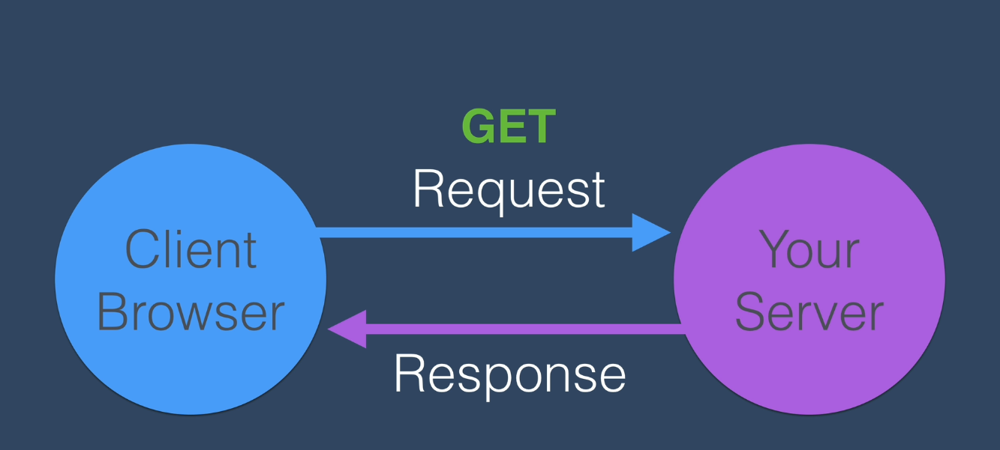
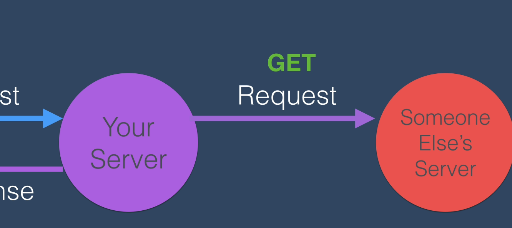
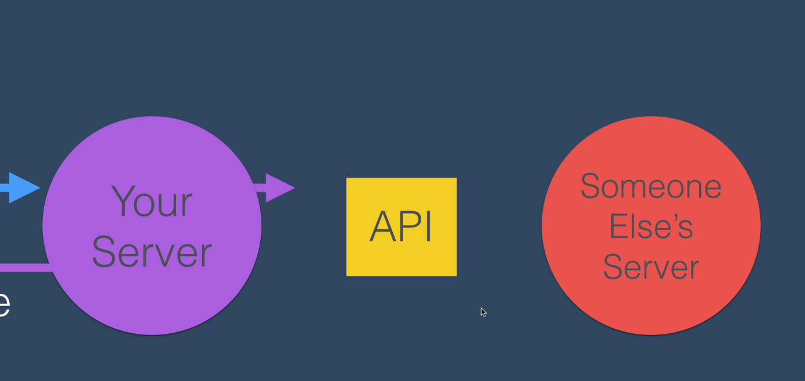

# GET-Anfrage mit dem HTTPS-Modul von node stellen

Wir haben bereits gesehen, wie wir APIs verwenden können, um Daten von verschiedenen Websites abzurufen

So wird der Prozess ungefähr aussehen.

Der Client auf der linken Seite, also unser Benutzer, wird unsere Webadresse in seinen Browser, z. B. Chrome oder Firefox, eingeben und eine Anfrage an unseren Server stellen, und zwar eine GET-Anfrage. Es wird also versucht, das HTML, CSS und Javascript von unserem Server zu holen.

An diesem Punkt sollte unser Server all diese Daten zurückgeben, das HTML, CSS und Javascript, und zwar in der Antwort. Aber um ihnen diese Antwort zu geben, die Daten von einem anderen Server enthält, müssen wir eine Anfrage an diesen anderen Server stellen.

Und das machen wir über deren API, also über das Menü, das sie uns für unsere Anfragen zur Verfügung gestellt haben, in dem sie angegeben haben, welche Dinge wir übergeben müssen, z. B. welche Parameter, welche Pfade, welche Schlüssel-Wert-Paare wir verwenden müssen, um die Antwort und die gewünschten Daten zu erhalten. Sobald wir die Daten erhalten haben, können wir sie in die Dateien einbauen, die wir an unseren Kunden, den Benutzer unserer Website, zurückschicken. Das ist nur ein grober Überblick darüber, was in dem Code, den wir schreiben werden, passieren wird. Aber im Grunde genommen wollen wir etwas sehr Einfaches wie dieses erstellen.