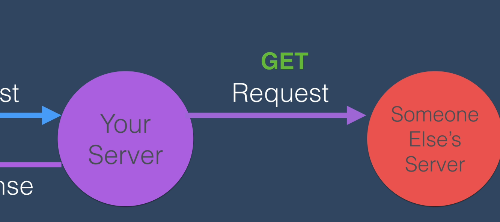

# Making GET request with node HTTPS Module

We've already seen how we can use APIs to get data from various web sites

This is what the process will roughly look like.

The client on the left, so this is our user, is going to be typing in our web address into their browser, say Chrome or Firefox, and that is going to make a request to our server, and that's going to be a GET request. So it's going to try and get the HTML, CSS and Javascript from our server.

Now at this point what happens is our server should return all of those pieces of data, the HTML, CSS and Javascript, and that's in the response. But in order to be able to give them that response that includes some data from somebody else's server, we're going to have to make a request to that other server.

And we're going to do this via their API, so via the menu that they provided for us to make our requests, where they've specified what are the things that we need to pass over, like what parameters, what paths, what key value pairs we have to use in order to get the response and the data that we want. So then, once we get the data, we can go back and incorporate that data into the files that we send back to our client, the user for our web site. That's just the high level overview of what's going to happen in the code that we're going to write. But effectively we're looking to create something very simple like this.