# Databases: SQL vs NOSQL

Databases are simply said persitently storing the data that the user generates. For example new blog posts or new comments or new users sign ups.

Now it's not just our website that's generating data. If you take a look at [internetlivestats](internetlivestats.com), you can see just how much data is being generated as we speak. It's an absolutely huge amount of data that's being generated all across the Internet and they all need to be saved somewhere.

That's why we need to know about databases.

Once you realize the need for databases, the next step is actually choosing one.

And if you look on the Internet this is actually not an easy task because there are so many databases out there. Even if you narrow it down to the databases that work well with Node.js, you still left with a lot of choice. And very frequently I'll come across blog posts have a title that's something like this: Cassandra vs MongoDB vs CouchDB vs... and it's just crazy the amount of choice that you have.

But there's a reason for that because depending on the type of data you're looking to store and the structure of your data, you might favor one of these databases over another. But no matter what choice you make the main difference between databases is whether if they are SQL based or if they are noSQL based. 

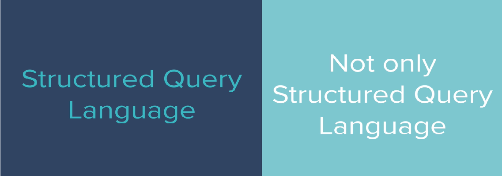

Now SQL or sequel stands for Structured Query Language and it's a really old school piece of technology that businesses have been using for many many years. 

Now NoSQL stands for Not Only Structured Query Language so they can actually be any format as long as it's not SQL although most of them follow a very similar structure.

Those are the two big families of databases that you get to choose from.


And we're going to talk about the differences between each and We are going to see how to work with both of these types of databases.

If you do a quick google, you will find that there are so many different types of databases that are categorized as SQL databases or noSQL databases.

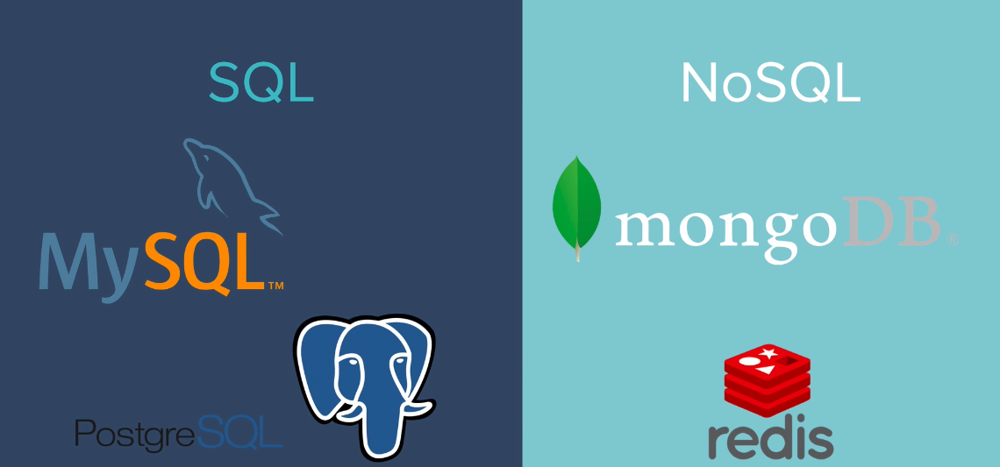

But the top four most popular databases at least when we're working with Node.js, for the SQL family that's MySQL and Postgres. And for noSQL it's going to be MongoDB and redis.


Now some of these databases you might have already heard of but a lot of people are confused as to when to use which and what are the similarities and differences and how do you choose anyways.


So let's talk about what are the differences between 

## SQL and NOSQL Structure


The first difference is in their structure.

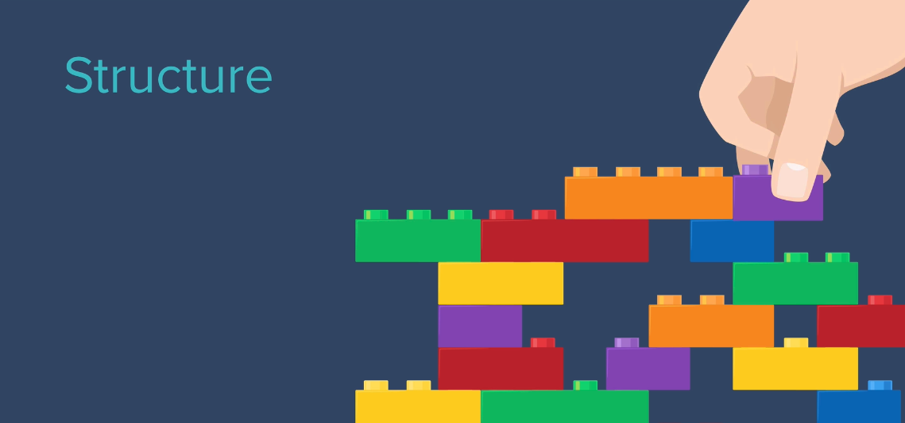


So let's say that you're starting a new business and you've decided to start selling stationery. Now because you're shipping a lot of your product to your customers you need to keep a record of their names and addresses. So you create a database for that.

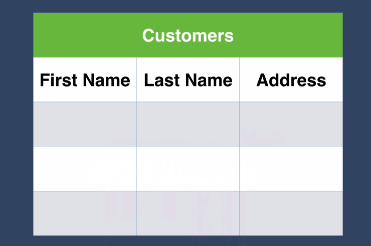

And if you used to excel and creating tables then you'll find that a SQL database will serve you quite well. A SQL database will group your data into tables. So this is how our customer data would look if we chose a SQL database such as mySQL or Postgres.

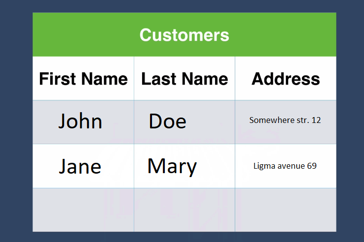

But sometimes you might find that sequel databases can be extremely inflexible.

For example let's say that in your shop you have me as a customer and I'm one of those annoying customers who don't really like having mail sent to my address. So I say to you, 'You know what? Why don't you deliver to my address but for all other communications I want you to just email me? Because we are after all in the 21st century.

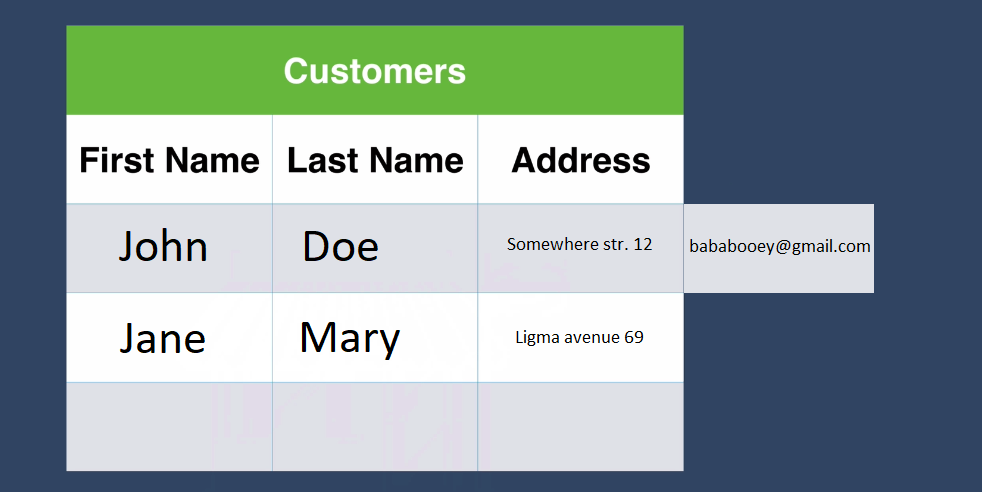

If you had a sequel table then you have a bit of a problem because that doesn't really fit with your table. You don't have a pre-specified email column to fit that data and none of your existing data have an email entry. And what if you had a customer who didn't want to give you any information at all? They didn't want to give you their address or their email and they'd rather protect their privacy. Well then you kind of have a gap in your table and it ends up looking very very irregular and that doesn't sit very well with sequel databases.


So if you chose a sequel database, what it will try to do is it will try to square off the table. So you can add a new column called email but for all the places where there's missing information it will automatically insert a null. And as we learned from previous programming lessons null can be very dangerous especially if you're not expecting something to be null or not have any data.

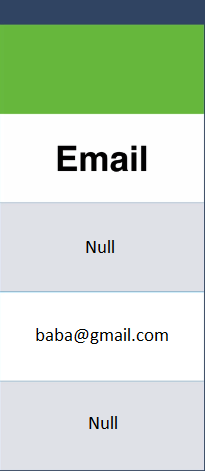


For example if you decide to send out your marketing emails, a lot of those emails are going to be going to an email address that's called null. But if you had a NoSQL based database such as MongoDB, then this wouldn't be a problem at all.

If you were working with Mongo the same data would be represented as JSON objects. So you would have key value pairs such as first name, Last name, address and if in one of those documents you had an extra key value pair such as email then it doesn't affect any of the other data records. And none of these records or documents actually have to be the same shape or follow the same structure.

```json
{
    first_name: "John",
    last_name: "Doe",
    address: "12 street idc anymore"
}
{
    first_name: "Mary",
    last_name: "Jane",
    address: "13 street nigthmare",
    email: "bababooey@gmail.com"
}
{
    first_name: "Jack",
    last_name: "Bauer",
}

```

If you're old enough to remember that ad with a PC Guy and Mac guy, it's kind of the same with SQL and NoSQL. NoSQL databases tend to be flashier, newer with modern syntax and modern methods but SQL database is old and reliable and it likes structure.

Everybody knows that guy who they work with in the office who really likes structure and for everybody to follow rules and to specify a structure ahead of time and just stick to it. But with NoSQL and especially MongoDB you're more flexible. You're able to adapt and maneuver around the situation as and when things come up. So it's really helpful for startups where your data structure is not predefined. You know one day you could be selling toasters and tomorrow you could be pivoting to giving massages. Then a NoSQL database can remain flexible and you're not bound to a particular structure. 

But even though the NoSQL guy is flashy and he's new and he's hip, you know I'm sure you've met people like this and some girls here probably met a lot of NoSQL guys in their time. And what they're not good at are relationships and this is another big difference between SQL and and NoSQL databases in a way that they implement relationships between your data.

## Relationships


Although previously we were comparing between SQL and NoSQL databases, you also often hear people refer to them as relational and non-relational databases.

And this is the highlight that SQL databases of really good at establishing relationships between your data. Coming back to our shop, let's say that you wanted to keep a record of all of the orders that are being made. So you want to know what's the name of the customer, who bought it, what's:

> their address

> what did they buy

> what was the price of the product

> how many of it did they buy

all of these things.

But it doesn't really make sense to cram it all into the same table. Especially if that same customer comes back and buys a different product then you have a lot of repeated data and it doesn't make any sense to cram everything into the same table. 

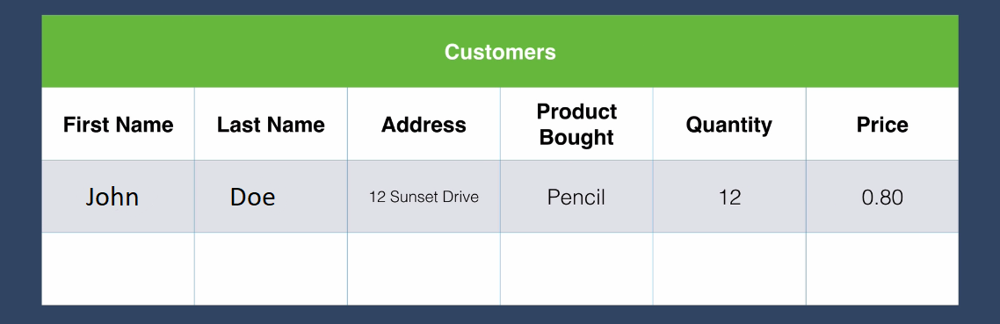

Using a SQL database what you would do is you would group related pieces of data into individual tables. So you might have a customer table, a products table and an orders table. And in your database you can specify a relationship between the tables. So for example you could link up the customers table through the customer ID to the orders table. And you could link the products table to the products ID in the orders table.


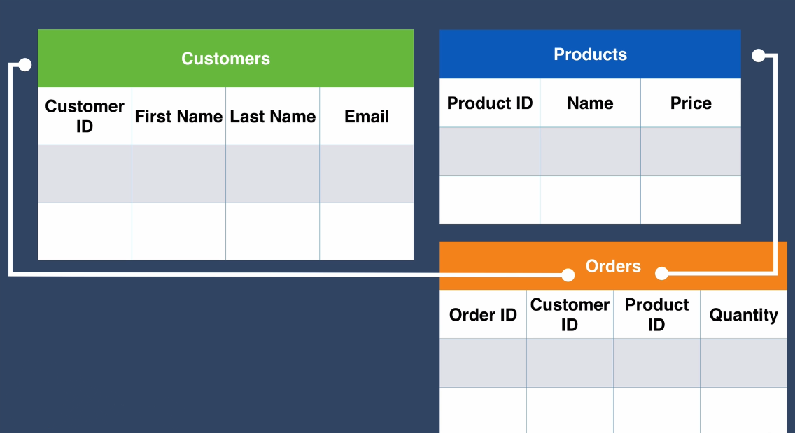


If we had some real data for example, we have a database of all of our customers and where they live. We have a table of our products and what their prices are. And we also have this Orders table which links up the data in the different tables. Let's say we have an order with order ID 1, our very first order. We can have a column where we specify the customer ID. So in this case it's linked to the customer that has an ID of 2.

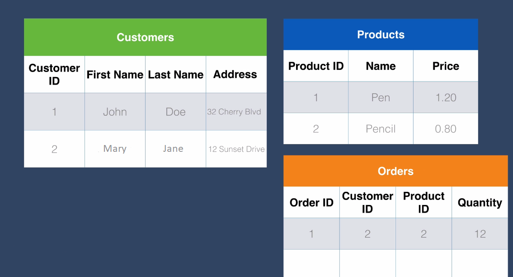

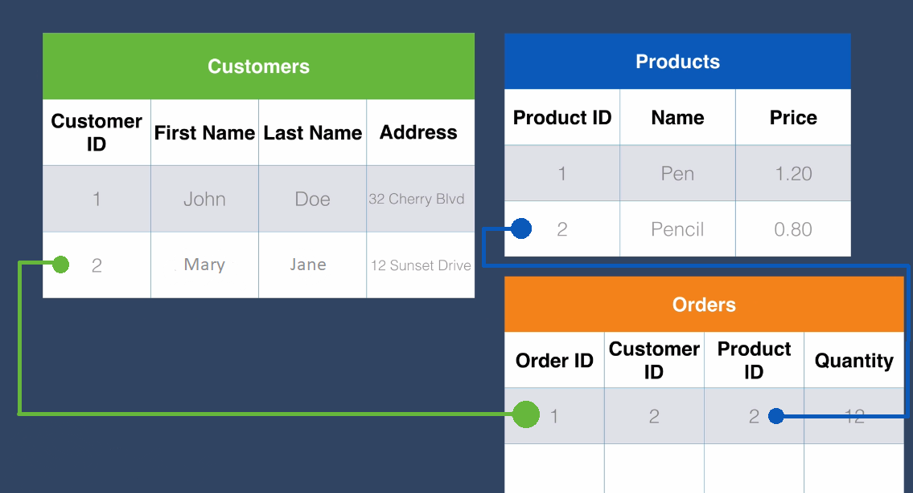

So we can know for each order which customer bought it and which products were bought. Now using a NoSQL database such as MongoDB you have to rethink how you organize your data. In this case we might have a document where we have an order ID.

```json
{
    order_id: order_01,
    customer: {
        first_name: "Mary",
        last_name: "Jane",
        address: "12 Sunset Drive"
    },
    products: {
        product_name: "Pencil",
        product_price: 0.80
    },
    order_quantity: 12
}
```

We have a key value pair that's a customer with customer as the key and their details as the value and also the products as its own embedded objects. So now we have embedded objects in order to represent the entire order. And this might lead to some data repetition.
So you could also organize your data in different documents

So say you have three objects. One has details of the order, one has details of the customer and one has details of the product. And you can also link them together although a little bit more clumsily through using references.

```json
{
    order_id: order_01,
    customer: person_01,
    products: product_01,
    orderquantity: 12
}
{
    person_id: person_01,
    first_name: "Mary",
    last_name: "Jane",
    address: "12 Sunset Drive"
}
{
    product_id: product_01
    product_name: "Pencil",
    product_price: 0.80
}
```

So for example in the order document, you can see the customer references the document with a person ID of person_01 and the product references a product with the ID of product_01. So this is how you might implement your relationships in a NoSQL database such as MongoDB. But it's a little bit clumsy and when you start searching this database that structured like this, it might not be quite as efficient or fast as a SQL database.


So depending on the structure of your data, you will want to choose a SQL or a NoSQL database. And you should know very often you will see on the Internet people saying MongoDB is the best database out there ever. And other people will say don't ever use MongoDB, it's the worst. Or you know MySQL is the best thing since sliced bread.

Don't believe what people say.


Instead you have to know what your particular situation is to choose the right database.

If you need to store data such as orders, customer details, products inventory, things that have lots of relationships between each other, then you might be better off choosing a SQL database such as MySQL or Postgres.

However if you have a website where you have something that's more of a one to many kind of relationship like here for example 
```json
{
    user:{
        username: "bababooey",
        first_name: "mary",
        last_name: "jane",
        posts: [
            {
                img: "https://s3.aws.bucket.com/images/post/imgs/ids/cattos.png",
                description: "best catto pic evur!!!",
                createdAt: 12324156100
            },
            {
                img: "https://s3.aws.bucket.com/images/post/imgs/ids/doggo.png",
                description: "Best boye evver!!",
                createdAt: 13245156100
            },
        ]
    }
}

```


say if we were making a database for Instagram, then we might have a user name, a first name, last name, and then we might have a post array. And so this is the array of objects and those objects each have an image URL description and the date that they were created. In this case where you have a single user generating lots of content creating a one user to many posts relationship, then this is much easier to map out using something like MongoDB.

The last difference I want to talk about is:

## Scalability

Despite it being relatively weak on the relationship front one of the reasons why you might use NoSQL over SQL is because of scalability. 

This is a real strong point of NoSQL databases and this is a reason why you might choose a NoSQL database over a SQL database. If you've ever had an Excel spreadsheet that has lots and lots of rows, so say 10,000+ rows then you might have experienced this. It gets slower and slower the more rows of data you add until a point where the file is so big that your computer can no longer handle it and you might get a pop up saying Excel cannot complete this task with available resources. Choose less data or close other applications. It's saying that you need a more powerful computer. 

If you are running your SQL database on your laptop for example then you might just get a more powerful computer, say a desktop computer with higher specs And once that start slowing down and struggling, then you might just go for a mainframe and buy the biggest computer that you can find. But as we saw previously there are some companies that have so much data. For example the number of websites that Google has to index and be able to serve up in searches is in the bazillions and they have so much data that even the fastest computer will slow down and struggle. Managing large amounts of data using SQL based databases it's kind of like scaling a building vertically. As soon as you have more data you just add floors onto your building until eventually you end up with the skyscraper of a building. It might just become unstable and end up collapsing on you. And it's also very costly to scale vertically like this. Now because the way that MongoDB organizes its data into smaller chunks or smaller documents of data where essentially each record or each row in the table is represented as a JSON object, then in this case instead of buying larger and larger computers, it allows for a distributed system. So your database can be distributed amongst lots and lots of different computers. And this is equivalent to building low but sturdy buildings and you scale horizontally so you build lots and lots of those. And all the data is distributed and spread out amongst all of them. So if we were to compare the most popular SQL database which is MySQL against the most popular NoSQL database which is MongoDB, then these are some of the pros and cons of each.

## Pros and Cons

1. SQL databases have been around for ages. That means that the technology is more mature. But also if you come across anything that's SQL related on the internet, it all looks like it was created in the 90s. MongoDB is shiny and new but as we're finding out some of the things are not really ironed out. That might mean more frequent changes in the technology as they find new problems and address them.

2. SQL databases run on a table structure as we've seen before whereas MongoDB works with a document structure. So this way individual rows of data can be each represented as a document.

3. SQL database you should have a structure in mind before you create your database. And this, in database lingo, is called a schema. So these are the names of your columns and the names of your tables and how many columns you might need. And SQL databases work really well if you have a fixed schema, so if you already know ahead of time what your customer database will look like, what your orders database will look like and you know that they're not likely to change. Whereas with something like MongoDB and other NoSQL databases, they're more flexible to changes. So if you're a young startup and you haven't really figured out how you're going to organize your data or what kind of data you're going to store, then it might be a better idea to choose this particular type of database.

4. As we saw earlier on, if you need to store data with a lot of relationships between the data then a SQL database will work out to be much faster when you query through your database. Whereas with something like MongoDB it can manage simple relationships but it's really not great when those relationships start to get complex and when you have data in MongoDB that's linked up with complex relationships The speed and efficiency can quickly go down.

5. SQL databases tend to scale vertically. So you tend to need more infrastructure, it's more costly. Whereas with MongoDB and other NoSQL databases they can scale horizontally and allows for a more distributed structure which makes it much easier to scale.

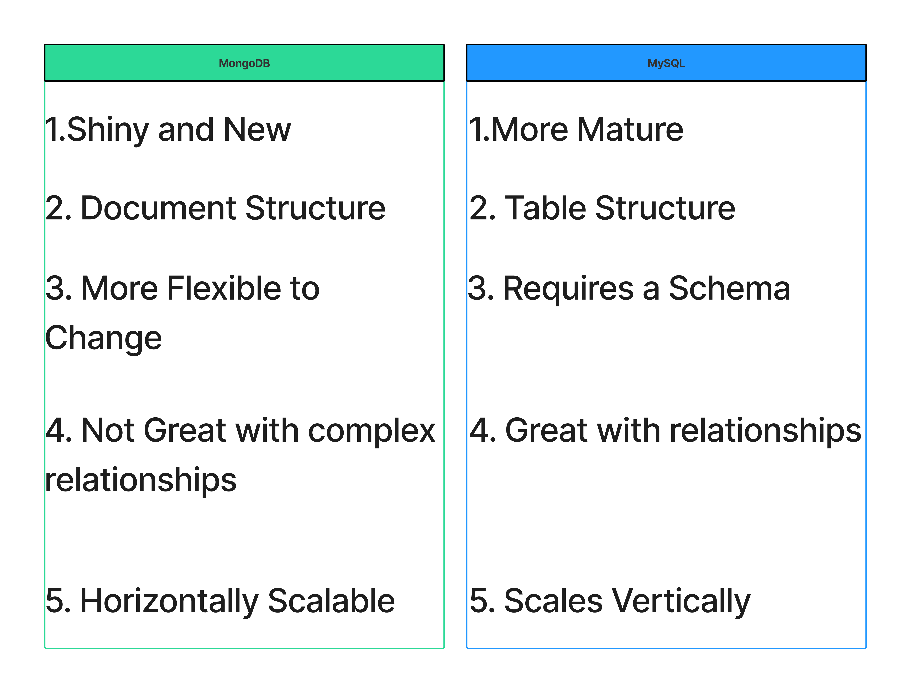


So this is your introduction for working with databases and especially looking at the differences between the two major families, SQL and NoSQL databases.

In the future we're going to explore in a more hands on way the differences between SQL and NoSQL so that you can try it out and see for yourself how they each work and experience some of the frustrations as well as the benefits of each.
