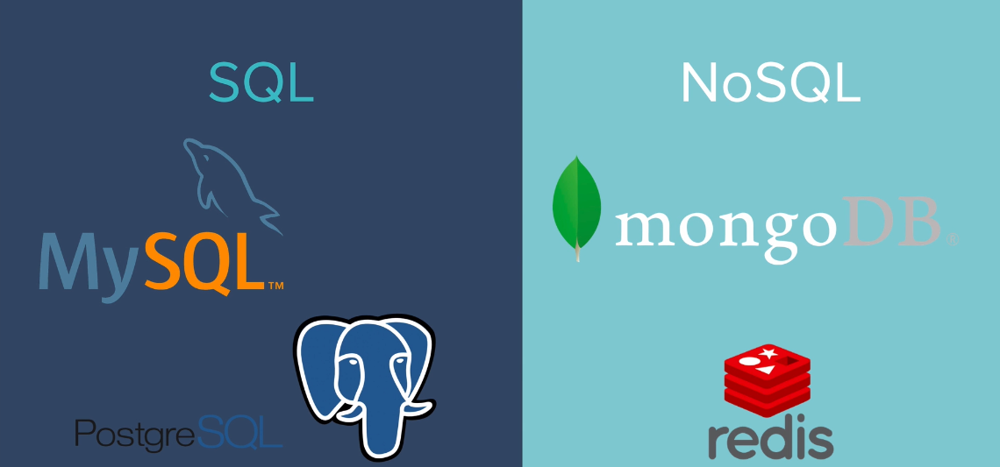
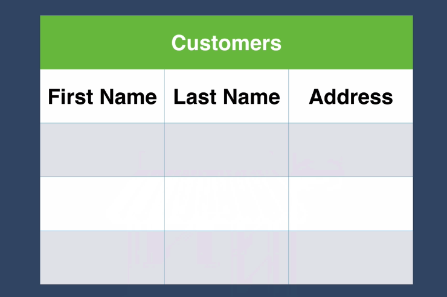
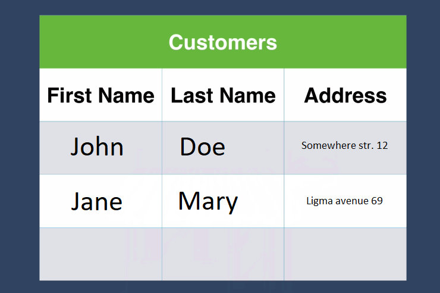
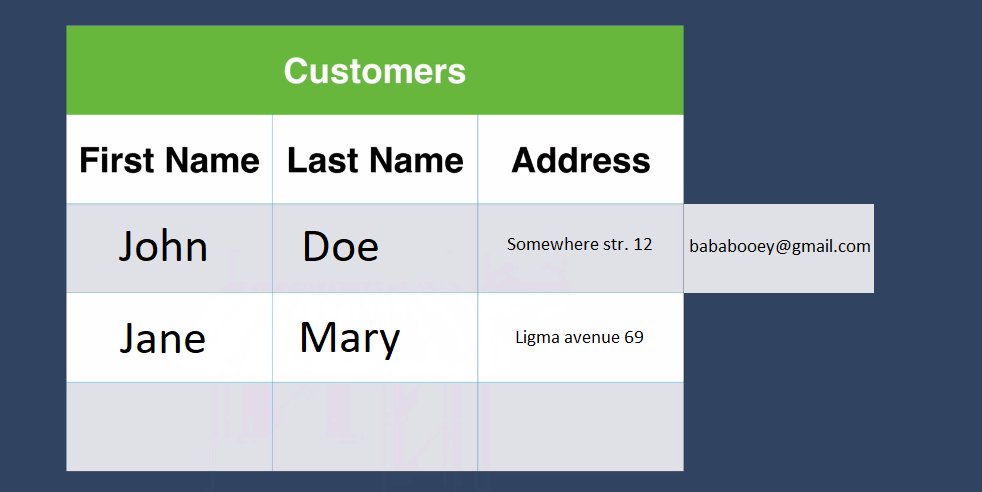
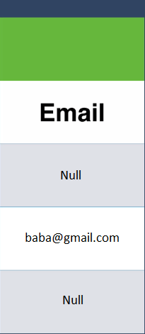
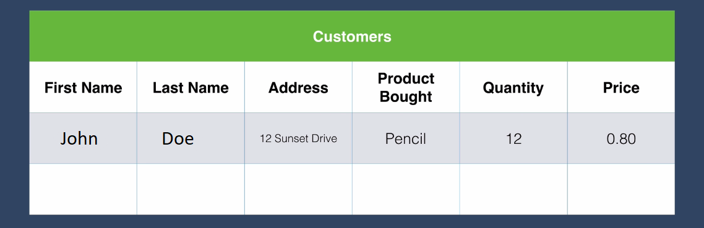
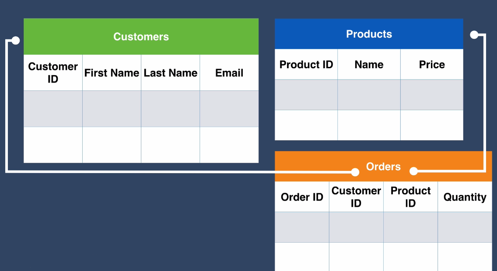
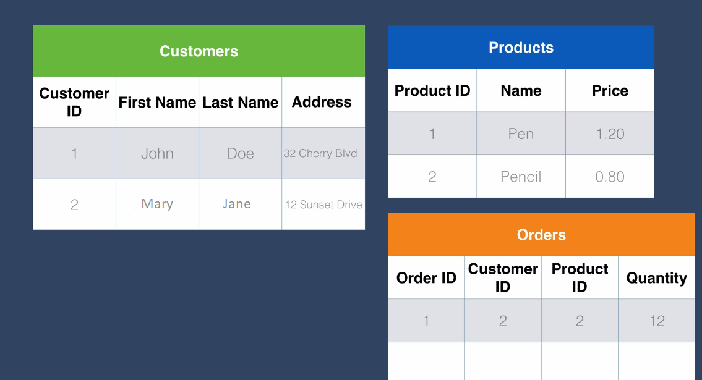
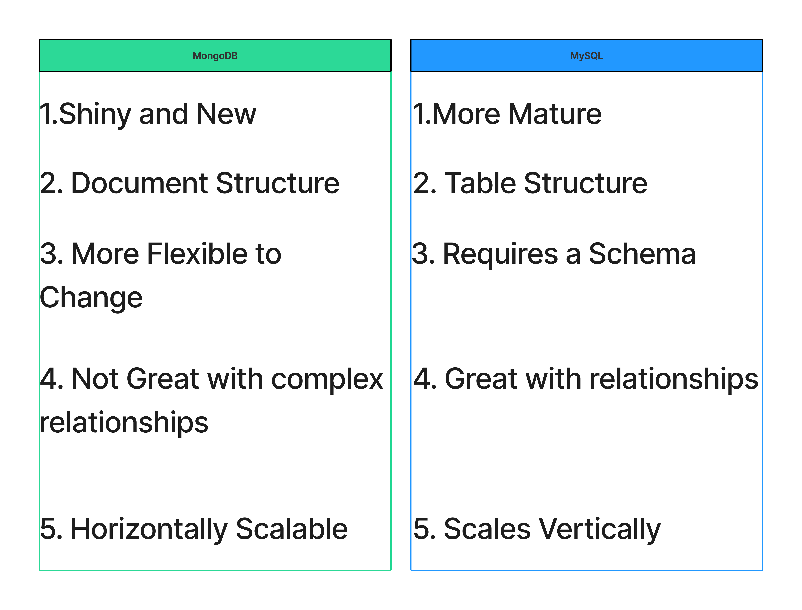

# Datenbanken: SQL vs. NOSQL

Datenbanken sind einfach gesagt die dauerhafte Speicherung von Daten, die der Benutzer erzeugt. Zum Beispiel neue Blog-Einträge oder neue Kommentare oder neue Benutzeranmeldungen.

Nun ist es nicht nur unsere Website, die Daten erzeugt. Wenn Sie einen Blick auf [internetlivestats](internetlivestats.com) werfen, können Sie sehen, wie viele Daten in diesem Moment erzeugt werden. Es handelt sich um eine absolut riesige Menge an Daten, die im gesamten Internet erzeugt werden, und sie müssen alle irgendwo gespeichert werden.

Deshalb müssen wir etwas über Datenbanken wissen.

Sobald man die Notwendigkeit von Datenbanken erkannt hat, ist der nächste Schritt die Auswahl einer Datenbank.

Und wenn man sich im Internet umsieht, ist das gar nicht so einfach, weil es so viele Datenbanken gibt. Selbst wenn man sich auf die Datenbanken beschränkt, die gut mit Node.js funktionieren, hat man immer noch eine große Auswahl. Und sehr häufig stoße ich auf Blogbeiträge mit einem Titel, der in etwa so lautet: Cassandra vs. MongoDB vs. CouchDB vs... und es ist einfach verrückt, wie viel Auswahl man hat.

Dafür gibt es einen Grund, denn je nach Art der zu speichernden Daten und der Struktur Ihrer Daten können Sie eine dieser Datenbanken einer anderen vorziehen. Aber egal, welche Wahl Sie treffen, der Hauptunterschied zwischen den Datenbanken besteht darin, ob sie auf SQL oder auf noSQL basieren. 


Die Abkürzung SQL steht für Structured Query Language (strukturierte Abfragesprache) und ist eine sehr alte Technologie, die von Unternehmen seit vielen Jahren verwendet wird. 

NoSQL steht für "Not Only Structured Query Language" (nicht nur strukturierte Abfragesprache) und kann jedes beliebige Format haben, solange es sich nicht um SQL handelt, obwohl die meisten von ihnen eine sehr ähnliche Struktur haben.

Das sind die beiden großen Datenbankfamilien, aus denen Sie wählen können.


Wir werden über die Unterschiede zwischen beiden sprechen und sehen, wie man mit diesen beiden Arten von Datenbanken arbeitet.

Wenn Sie kurz googeln, werden Sie feststellen, dass es so viele verschiedene Arten von Datenbanken gibt, die als SQL-Datenbanken oder noSQL-Datenbanken kategorisiert werden.



Aber die vier beliebtesten Datenbanken, zumindest wenn wir mit Node.js arbeiten, sind MySQL und Postgres. Und für noSQL sind es MongoDB und redis.


Von einigen dieser Datenbanken haben Sie vielleicht schon gehört, aber viele Leute sind verwirrt, wenn es darum geht, welche zu verwenden und was die Gemeinsamkeiten und Unterschiede sind und wie man sich überhaupt entscheidet.


Lassen Sie uns also darüber sprechen, was die Unterschiede sind zwischen 

## SQL und NOSQL Struktur


Der erste Unterschied liegt in ihrer Struktur.


Nehmen wir an, Sie gründen ein neues Unternehmen und haben beschlossen, Schreibwaren zu verkaufen. Da Sie viele Ihrer Produkte an Ihre Kunden verschicken, müssen Sie deren Namen und Adressen aufzeichnen. Also erstellen Sie eine Datenbank für diese Zwecke.



Wenn Sie mit Excel und der Erstellung von Tabellen vertraut sind, werden Sie feststellen, dass eine SQL-Datenbank Ihnen sehr gute Dienste leisten kann. In einer SQL-Datenbank werden Ihre Daten in Tabellen gruppiert. So würden unsere Kundendaten aussehen, wenn wir eine SQL-Datenbank wie mySQL oder Postgres verwenden würden.



Manchmal kann es jedoch vorkommen, dass Folgedatenbanken extrem unflexibel sind.

Nehmen wir zum Beispiel an, dass Sie in Ihrem Geschäft mich als Kunden haben und ich einer dieser lästigen Kunden bin, die es nicht wirklich mögen, wenn man ihnen Post an meine Adresse schickt. Also sage ich zu Ihnen: "Wissen Sie was? Warum liefern Sie nicht an meine Adresse, aber für alle anderen Mitteilungen möchte ich, dass Sie mir einfach eine E-Mail schicken? Wir leben schließlich im 21. Jahrhundert.



Wenn Sie eine Folgetabelle haben, dann haben Sie ein kleines Problem, denn das passt nicht wirklich zu Ihrer Tabelle. Sie haben keine vordefinierte E-Mail-Spalte, in die diese Daten passen, und keine Ihrer vorhandenen Daten haben einen E-Mail-Eintrag. Und was wäre, wenn Sie einen Kunden hätten, der Ihnen überhaupt keine Informationen geben wollte? Er wollte Ihnen weder seine Adresse noch seine E-Mail-Adresse geben und lieber seine Privatsphäre schützen. Dann haben Sie eine Art Lücke in Ihrer Tabelle, die dann sehr unregelmäßig aussieht, und das passt nicht gut zu Folgedatenbanken.


Wenn Sie sich also für eine Folgedatenbank entscheiden, wird diese versuchen, die Tabelle auszugleichen. Sie können also eine neue Spalte mit dem Namen E-Mail hinzufügen, aber an allen Stellen, an denen Informationen fehlen, wird automatisch eine Null eingefügt. Und wie wir in früheren Programmierlektionen gelernt haben, können Nullen sehr gefährlich sein, vor allem, wenn Sie nicht erwarten, dass etwas Null ist oder keine Daten enthält.




Wenn Sie beispielsweise Ihre Marketing-E-Mails verschicken wollen, werden viele dieser E-Mails an eine E-Mail-Adresse gehen, die als null bezeichnet wird. Bei einer NoSQL-basierten Datenbank wie MongoDB wäre dies jedoch überhaupt kein Problem.

Wenn Sie mit Mongo arbeiten würden, würden dieselben Daten als JSON-Objekte dargestellt werden. Sie hätten also Schlüssel-Wert-Paare wie Vorname, Nachname, Adresse, und wenn Sie in einem dieser Dokumente ein zusätzliches Schlüssel-Wert-Paar wie z. B. E-Mail hätten, hätte das keine Auswirkungen auf die anderen Datensätze. Und keiner dieser Datensätze oder Dokumente muss die gleiche Form haben oder der gleichen Struktur folgen.

```json
{
    vor_name: "John",
    last_name: "Doe",
    address: "12 street idc anymore"
}
{
    vor_name: "Mary",
    nach_name: "Jane",
    address: "13 street nigthmare",
    email: "bababooey@gmail.com"
}
{
    vor_name: "Jack",
    nach_name: "Bauer",
}

```

Wenn Sie alt genug sind, um sich an den Werbespot mit dem PC-Typ und dem Mac-Typ zu erinnern, dann ist es mit SQL und NoSQL in etwa genauso. NoSQL-Datenbanken sind in der Regel auffälliger, neuer mit moderner Syntax und modernen Methoden, aber SQL-Datenbanken sind alt und zuverlässig und mögen Strukturen.

Jeder kennt den Typ, mit dem man im Büro zusammenarbeitet, der es sehr mag, wenn alle Regeln befolgt werden und eine Struktur im Voraus festgelegt wird, an die man sich einfach hält. Aber mit NoSQL und insbesondere MongoDB ist man flexibler. Man ist in der Lage, die Situation anzupassen und zu manövrieren, wenn sich etwas ergibt. Für Startups, deren Datenstruktur nicht vordefiniert ist, ist das sehr hilfreich. Sie wissen, dass Sie an einem Tag Toaster verkaufen und morgen auf Massagen umsteigen könnten. Dann kann eine NoSQL-Datenbank flexibel bleiben und Sie sind nicht an eine bestimmte Struktur gebunden. 

Aber auch wenn der NoSQL-Typ auffällig, neu und hip ist, bin ich mir sicher, dass Sie solche Leute kennen, und einige der Mädchen hier haben wahrscheinlich schon viele NoSQL-Typen getroffen. Und was sie nicht gut können, sind Beziehungen, und das ist ein weiterer großer Unterschied zwischen SQL- und NoSQL-Datenbanken, dass sie Beziehungen zwischen Ihren Daten implementieren.

## Beziehungen


Obwohl wir zuvor zwischen SQL- und NoSQL-Datenbanken verglichen haben, hört man auch oft, dass sie als relationale und nicht-relationale Datenbanken bezeichnet werden.

Dabei wird hervorgehoben, dass SQL-Datenbanken wirklich gut darin sind, Beziehungen zwischen Ihren Daten herzustellen. Um auf unser Geschäft zurückzukommen: Nehmen wir an, Sie möchten alle Bestellungen aufzeichnen, die gemacht werden. Sie möchten also wissen, wie der Name des Kunden lautet, wer ihn gekauft hat, wie die Adresse lautet:

> Seine/Ihre Adresse

> was er/Sie gekauft hat

> wie hoch der Preis des Produkts war

> wie viel er/Sie davon gekauft hat

all diese Dinge.

Aber es macht nicht wirklich Sinn, alles in eine Tabelle zu packen. Vor allem, wenn derselbe Kunde wiederkommt und ein anderes Produkt kauft, haben Sie eine Menge wiederholter Daten, und es macht keinen Sinn, alles in dieselbe Tabelle zu packen. 



Bei der Verwendung einer SQL-Datenbank würden Sie zusammengehörige Daten in einzelnen Tabellen gruppieren. Sie könnten also eine Kundentabelle, eine Produkttabelle und eine Auftragstabelle haben. Und in Ihrer Datenbank können Sie eine Beziehung zwischen den Tabellen festlegen. So können Sie zum Beispiel die Kundentabelle über die Kunden-ID mit der Auftragstabelle verknüpfen. Und Sie könnten die Tabelle "Produkte" mit der Produkt-ID in der Tabelle "Bestellungen" verknüpfen.





Wenn wir einige echte Daten hätten, hätten wir zum Beispiel eine Datenbank mit allen unseren Kunden und deren Wohnort. Wir haben eine Tabelle mit unseren Produkten und deren Preisen. Und wir haben auch diese Tabelle Bestellungen, die die Daten in den verschiedenen Tabellen miteinander verknüpft. Nehmen wir an, wir haben eine Bestellung mit der Bestell-ID 1, unsere allererste Bestellung. Wir können eine Spalte haben, in der wir die Kunden-ID angeben. In diesem Fall ist sie also mit dem Kunden mit der ID 2 verknüpft.




So können wir für jede Bestellung wissen, welcher Kunde sie gekauft hat und welche Produkte gekauft wurden. Wenn Sie nun eine NoSQL-Datenbank wie MongoDB verwenden, müssen Sie überdenken, wie Sie Ihre Daten organisieren. In diesem Fall könnten wir ein Dokument haben, in dem wir eine Bestell-ID haben.

```json
{
    order_id: order_01,
    customer: {
        vor_name: "Mary",
        Nachname: "Jane",
        address: "12 Sunset Drive"
    },
    Produkte: {
        product_name: "Bleistift",
        product_price: 0.80
    },
    order_quantity: 12
}
```

Wir haben ein Schlüssel-Wert-Paar, d. h. einen Kunden mit Kunden als Schlüssel und seinen Details als Wert sowie die Produkte als eigene eingebettete Objekte. Jetzt haben wir also eingebettete Objekte, um die gesamte Bestellung darzustellen. Dies kann zu Datenwiederholungen führen.
Sie könnten Ihre Daten also auch in verschiedenen Dokumenten organisieren

Sagen wir, Sie haben drei Objekte. Eines enthält die Details der Bestellung, eines die Details des Kunden und eines die Details des Produkts. Und Sie können sie auch miteinander verknüpfen, wenn auch etwas umständlicher, indem Sie Referenzen verwenden.


```json
{
    order_id: order_01,
    customer: person_01,
    products: product_01,
    orderquantity: 12
}
{
    person_id: person_01,
    first_name: "Mary",
    last_name: "Jane",
    address: "12 Sunset Drive"
}
{
    product_id: product_01
    product_name: "Pencil",
    product_price: 0.80
}
```
So können Sie zum Beispiel im Bestelldokument sehen, dass der Kunde auf das Dokument mit der Personen-ID person_01 verweist und das Produkt auf ein Produkt mit der ID product_01. So könnten Sie also Ihre Beziehungen in einer NoSQL-Datenbank wie MongoDB implementieren. Es ist jedoch etwas umständlich, und wenn Sie anfangen, diese so strukturierte Datenbank zu durchsuchen, ist sie möglicherweise nicht ganz so effizient oder schnell wie eine SQL-Datenbank.


Je nach der Struktur Ihrer Daten werden Sie sich also für eine SQL- oder eine NoSQL-Datenbank entscheiden müssen. Und Sie sollten wissen, dass Sie im Internet sehr oft Leute sehen werden, die sagen, dass MongoDB die beste Datenbank überhaupt ist. Andere wiederum sagen, dass MongoDB die schlechteste ist. Oder Sie wissen, dass MySQL das Beste seit der Erfindung des Brotes ist.

Glauben Sie nicht, was die Leute sagen.


Um die richtige Datenbank zu wählen, müssen Sie wissen, was Ihre spezielle Situation ist.

Wenn Sie Daten wie z. B. Bestellungen, Kundendaten, Warenbestände oder Dinge, die viele Beziehungen untereinander haben, speichern müssen, dann ist eine SQL-Datenbank wie MySQL oder Postgres vielleicht besser geeignet.

Wenn Sie jedoch eine Website haben, auf der Sie etwas haben, das eher eine Beziehung von eins zu vielen ist, wie zum Beispiel hier 
```json
{
    Benutzer:{
        benutzername: "bababooey",
        vor_name: "mary",
        nachname: "jane",
        posts: [
            {
                img: "https://s3.aws.bucket.com/images/post/imgs/ids/cattos.png",
                description: "best catto pic evur!!!",
                createdAt: 12324156100
            },
            {
                img: "https://s3.aws.bucket.com/images/post/imgs/ids/doggo.png",
                description: "Best boye evver!!",
                createdAt: 13245156100
            },
        ]
    }
}

```


Wenn wir z.B. eine Datenbank für Instagram erstellen würden, hätten wir einen Benutzernamen, einen Vornamen, einen Nachnamen und dann ein Array mit Beiträgen. Dies ist also das Array von Objekten und diese Objekte haben jeweils eine Bild-URL-Beschreibung und das Datum, an dem sie erstellt wurden. In diesem Fall, in dem ein einzelner Benutzer viele Inhalte generiert und eine Beziehung zwischen einem Benutzer und vielen Beiträgen herstellt, ist es viel einfacher, dies mit etwas wie MongoDB abzubilden.

Der letzte Unterschied, über den ich sprechen möchte, ist:

## Skalierbarkeit

Einer der Gründe, warum Sie NoSQL gegenüber SQL bevorzugen, ist die Skalierbarkeit, auch wenn sie bei den Beziehungen relativ schwach ist. 

Dies ist eine echte Stärke von NoSQL-Datenbanken und ein Grund, warum Sie eine NoSQL-Datenbank einer SQL-Datenbank vorziehen sollten. Wenn Sie schon einmal mit einer Excel-Tabelle gearbeitet haben, die viele, viele Zeilen hat, sagen wir 10.000+ Zeilen, dann haben Sie das vielleicht schon erlebt. Es wird immer langsamer, je mehr Datenzeilen Sie hinzufügen, bis zu einem Punkt, an dem die Datei so groß ist, dass Ihr Computer sie nicht mehr verarbeiten kann, und Sie möglicherweise ein Popup-Fenster erhalten, das besagt, dass Excel diese Aufgabe mit den verfügbaren Ressourcen nicht bewältigen kann. Wählen Sie weniger Daten oder schließen Sie andere Anwendungen. Dies bedeutet, dass Sie einen leistungsfähigeren Computer benötigen. 

Wenn Sie Ihre SQL-Datenbank z. B. auf Ihrem Laptop betreiben, könnten Sie sich einfach einen leistungsfähigeren Computer zulegen, z. B. einen Desktop-Computer mit höheren Spezifikationen. Aber wie wir bereits gesehen haben, gibt es einige Unternehmen, die so viele Daten haben. Die Zahl der Websites, die Google indexieren und in der Suche anzeigen muss, geht beispielsweise in die Milliarden, und die Datenmenge ist so groß, dass selbst der schnellste Computer langsam wird und Probleme hat. Die Verwaltung großer Datenmengen mit SQL-basierten Datenbanken ist wie die vertikale Skalierung eines Gebäudes. Sobald man mehr Daten hat, fügt man dem Gebäude einfach weitere Stockwerke hinzu, bis man schließlich bei einem Wolkenkratzer angelangt ist. Es könnte einfach instabil werden und auf Sie einstürzen. Und es ist auch sehr kostspielig, auf diese Weise vertikal zu skalieren. Die Art und Weise, wie MongoDB seine Daten in kleinere Stücke oder kleinere Datendokumente organisiert, bei denen im Wesentlichen jeder Datensatz oder jede Zeile in der Tabelle als JSON-Objekt dargestellt wird, ermöglicht in diesem Fall ein verteiltes System, anstatt immer größere Computer zu kaufen. Ihre Datenbank kann also auf viele, viele verschiedene Computer verteilt werden. Das ist vergleichbar mit dem Bau von niedrigen, aber stabilen Gebäuden, die man horizontal skaliert und von denen man viele, viele baut. Und alle Daten werden auf all diese Computer verteilt. Wenn wir also die populärste SQL-Datenbank, MySQL, mit der populärsten NoSQL-Datenbank, MongoDB, vergleichen, dann sind dies einige der Vor- und Nachteile der beiden.


## Pro und Kontra

1. SQL-Datenbanken gibt es schon seit langem. Das bedeutet, dass die Technologie ausgereifter ist. Aber wenn man im Internet auf irgendetwas stößt, das mit SQL zu tun hat, sieht alles aus, als wäre es in den 90er Jahren entstanden. MongoDB glänzt und ist neu, aber wie wir feststellen, sind einige Dinge noch nicht ganz ausgereift. Das könnte bedeuten, dass die Technologie häufiger geändert wird, wenn neue Probleme gefunden und gelöst werden.

2. SQL-Datenbanken arbeiten mit einer Tabellenstruktur, wie wir bereits gesehen haben, während MongoDB mit einer Dokumentenstruktur arbeitet. Auf diese Weise können einzelne Datenzeilen jeweils als Dokument dargestellt werden.

3. Bei SQL-Datenbanken sollten Sie eine Struktur im Kopf haben, bevor Sie Ihre Datenbank erstellen. Im Datenbankjargon nennt man dies ein Schema. Das sind also die Namen Ihrer Spalten und die Namen Ihrer Tabellen und die Anzahl der Spalten, die Sie benötigen. Und SQL-Datenbanken funktionieren sehr gut, wenn Sie ein festes Schema haben, wenn Sie also schon im Voraus wissen, wie Ihre Kundendatenbank aussehen wird, wie Ihre Auftragsdatenbank aussehen wird, und Sie wissen, dass sie sich wahrscheinlich nicht ändern werden. Bei MongoDB und anderen NoSQL-Datenbanken hingegen ist man flexibler gegenüber Änderungen. Wenn Sie also ein junges Startup sind und noch nicht genau wissen, wie Sie Ihre Daten organisieren oder welche Art von Daten Sie speichern wollen, dann ist es vielleicht besser, sich für diesen speziellen Datenbanktyp zu entscheiden.

4. Wie wir bereits gesehen haben, ist eine SQL-Datenbank viel schneller bei der Abfrage Ihrer Datenbank, wenn Sie Daten mit vielen Beziehungen zwischen den Daten speichern müssen. MongoDB hingegen kann zwar einfache Beziehungen verwalten, ist aber nicht so gut, wenn diese Beziehungen komplex werden, und wenn Sie Daten in MongoDB haben, die mit komplexen Beziehungen verknüpft sind, kann die Geschwindigkeit und Effizienz schnell sinken.

5. SQL-Datenbanken neigen dazu, vertikal zu skalieren. Man braucht also mehr Infrastruktur, und das ist teurer. MongoDB und andere NoSQL-Datenbanken hingegen können horizontal skaliert werden und ermöglichen eine stärker verteilte Struktur, was die Skalierung erheblich erleichtert.



Dies war also eine Einführung in die Arbeit mit Datenbanken und insbesondere in die Unterschiede zwischen den beiden großen Datenbankfamilien, SQL und NoSQL.

In Zukunft werden wir die Unterschiede zwischen SQL und NoSQL genauer erforschen, damit Sie selbst ausprobieren können, wie sie funktionieren, und einige der Frustrationen, aber auch die Vorteile der beiden Systeme kennenlernen.