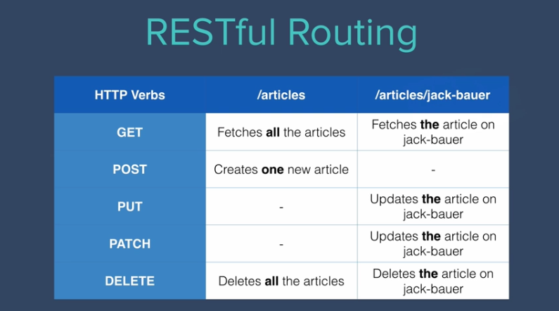

# Rest

just like crud we have rest

POST == CREATE

```js
app.post(function(req, res){
    
})
```

GET == READ

```js
app.get(function(req, res){
    
})
```


PUT/ PATCH == UPDATE
```js
app.put(function(req, res){
    
})
app.patch(function(req, res){
    
})
```
difference between put and patch:

Well here's a good analogy. Recently I went onto Amazon and I found a really nice looking bicycle and because I really wanted to poison my lungs by exercising around Frankfurt, I clicked on the buy now button. So there I was super happy super excited for my bicycle to arrive and then on the day of arrival I open up that box and my bicycle was really messed up. The whole front wheel was broken so I'm not really sure what happened at the Amazon warehouse but I got in touch with them and I wanted to try and figure out how we can solve this problem.So there were two ways that they could fix this problem.

Option one was they send me an entire new bike. So this is the equivalent of PUT. You're updating your database by sending an entire entry to replace the previous one.

PUT

```JSON
{
    "item": "bike",
    "quantity" : 86,
    "tags": ["sports", "fitness"],
    "size": "adult"
}
```

```JSON
{
    "item": "new-bike",
    "quantity" : 85,
    "tags": ["outdoors", "fit"],
    "size": "kids"
}
```

Now the other option Amazon offered was for them to simply send me a new tire. That was the only thing that was broken, the rest the bike was fine and in order to save the world from carbon emissions shipping a wheel is much better than shipping an entire bicycle. And this is the same as patch. So when you're sending a patch request to the server you're only sending the piece of data that needs to be updated. Instead of the entire entry that will be replaced you'll simply just updating the thing that needs to be updated. So when we see this in practice only to think back to this bicycle analogy and maybe it'll help you try to understand the difference between these two words.

```JSON
{
    "item": "bike",
    "quantity" : 86,
    "tags": ["sports", "fitness"],
    "size": "adult"
}
```

```JSON
{
    "item": "bike",
    "quantity" : 85,
    "tags": ["sports", "fitness"],
    "size": "adult"
}
```

DELETE == DELETE

```js
app.delete(function(req,res){

})
```

this just deletes or destroys a particular piece of data in our database.


the next thing to talk about is the specific pattern of routes and endpoints that you have to use in order to make your API RESTful.


So just as when you go on a Safari there are different routes that you would use to reach say the elephant area or the camels or the hippos, in our server we can specify specific routes or URLs in order to access certain resources. So you might have you know www.google.com/elephants then that would bring up all of the elephants and /camels would be for the camels and hippos. So these are routes and we've already used route before.



So now that we've seen how HTTP request verbs work and the pattern of routes that make your API RESTful, the next step is to get started and actually build our very own API.