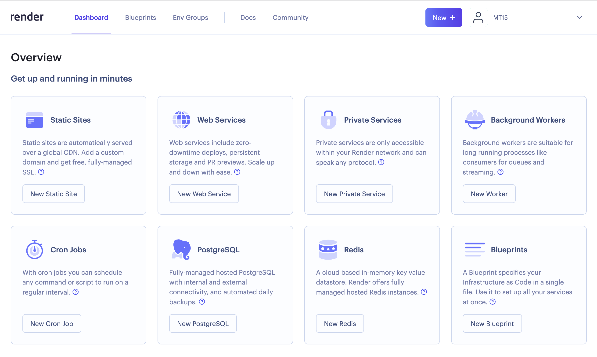
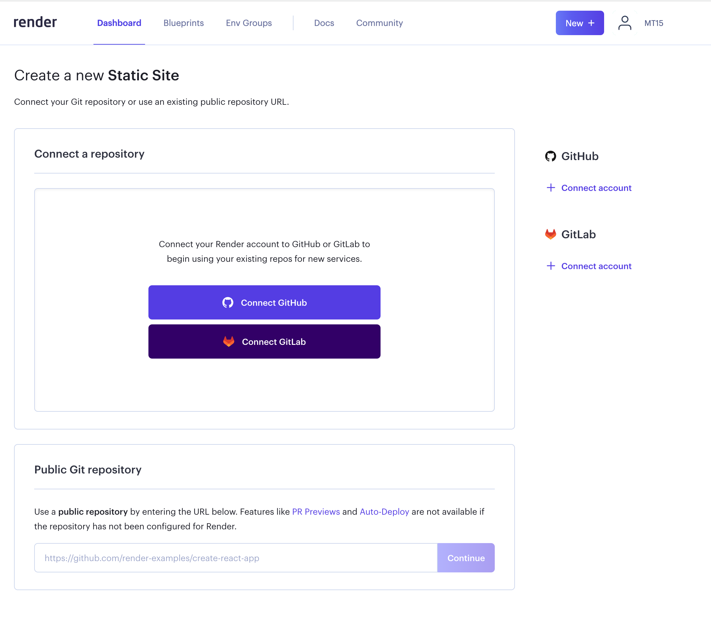
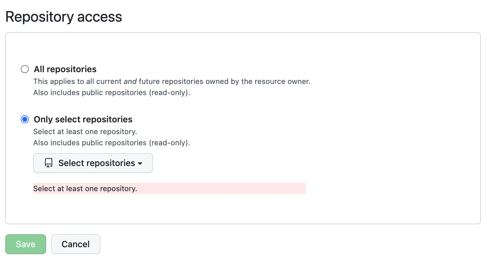
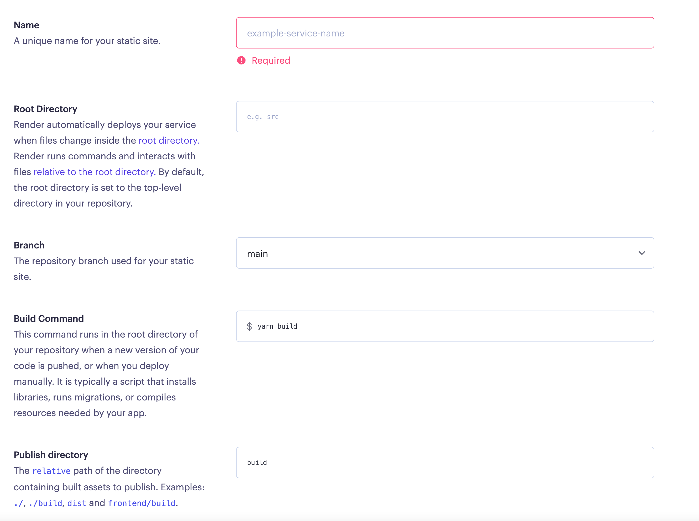
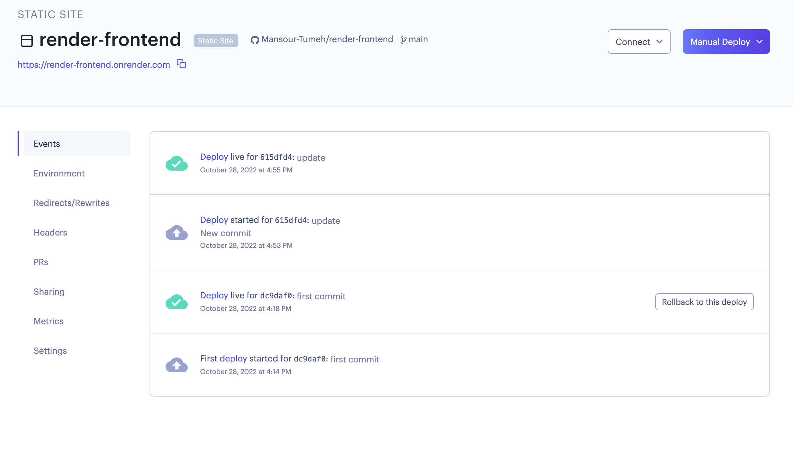
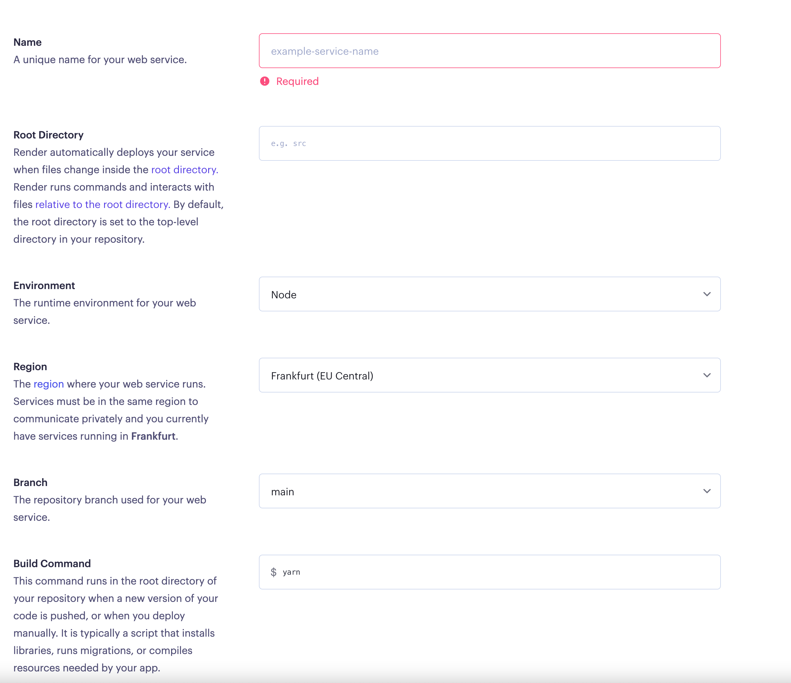
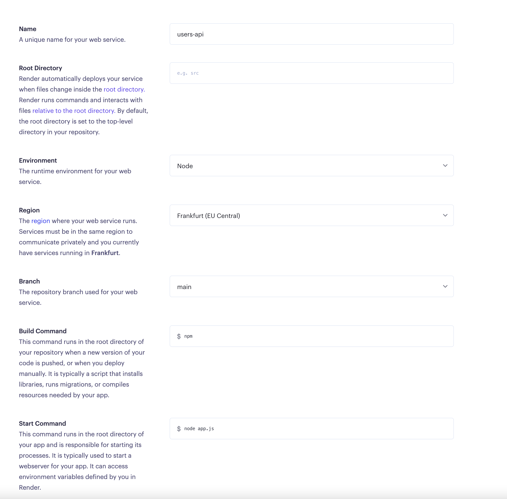

## Deploying to Render
[Render](https://render.com/). It's a free alternative to Heroku with a similar easy deployment process.
1. first step is to register in [Render](https://render.com/)

 

2. after you signed up and logged in to your account, you will see a dashboard like this:

> you need to connect your github account to render and select your repository to deploy.

3. to deploy fullstack app you can deploy two repository (frontend,backend)
you can also deploy one repository look at this [link](./readme2.md) 

- To deploy a React application, click on the New Static Site Service under the Static Sites option.

-  You can also click on the New + button displayed in the header just before your profile picture and select Static site option.

- Once clicked, you will see the following screen:

- Click on the Connect account

Click on the Configure link  
and give access to only selected repositories which you currently need to deploy.

Now, you will see the following screen:

 - Here, for the Name field, enter the a short and simple name to identify your websit
 > example: i used the name : `render-frontend` 
 then my application URL once the application is deployed is:
 https://render-frontend.onrender.com/

 - add the Branch name, in my case : `main`
 - add the build command : `npm run build`
 - Publich directory : `build` 
 - click on Create Static Site Button

now the frontend link is ready : 

> any update on the repository will redeploy the repo again.
---
Now we are ready To deploy a Node.js application, click on the New Web Service button under the Web Services option.

- you need to add the node js code to a new repository and connect with render after that click next

- the name should be simple and will be used in our frontend.
> we will replace `http://localhost:5000/getallusers` with `https://users-app-api.onrender.com/getallusers`

- environment: `node`
- Branch : the default branch in this example is main
- build command: `npm`
- start command:enter `node app.js` as the value, if your entry file is `app.js`.  

