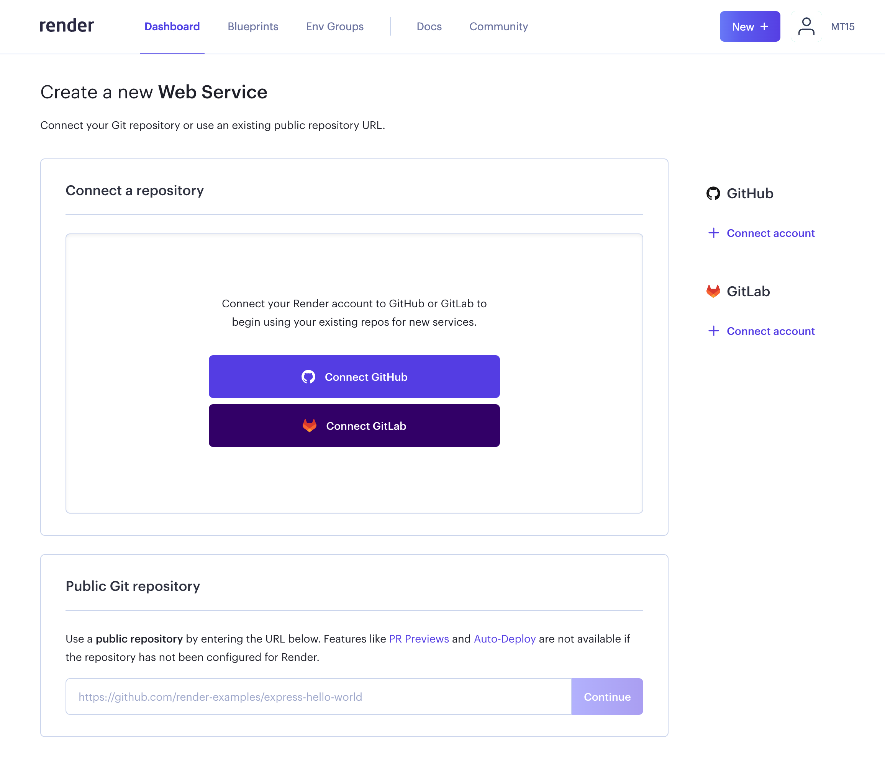
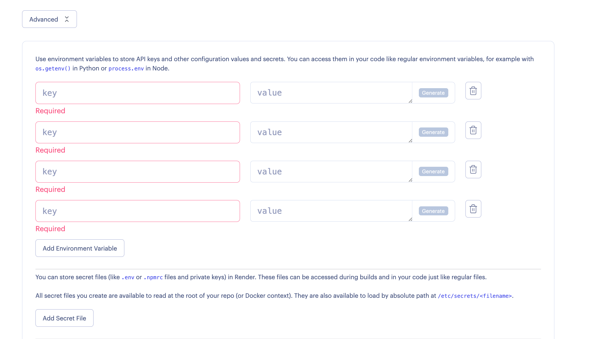
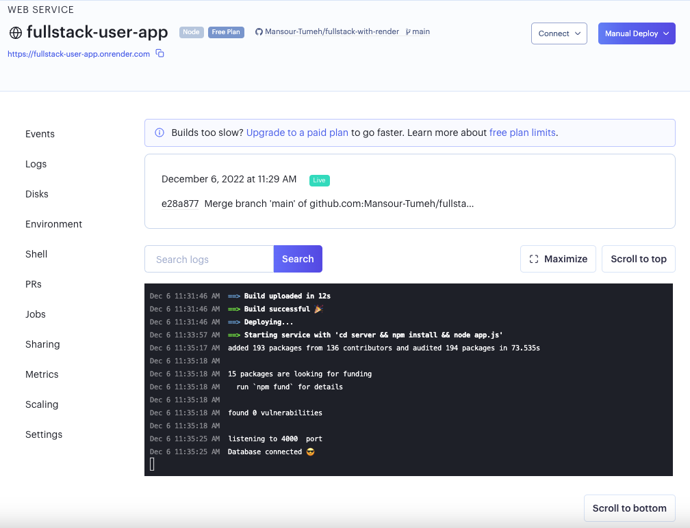

## Deploying Fullstack to Render (one repository)


- To deploy a Fullstack  application with one repository, click on the New + button displayed in the header just before your profile picture and select New Web Service.




- connect your Github repository
- in your front end you can just use the endpoint without `localhost:5000//`
```js
try{
            axios.get('/getallusers').then(res=>{
                setuser({
                    students:res.data
                });
                
            })
        }catch(err){
            console.log("error while getting users",err);
       }
````
- in your server file add this code : 
```js
app.use(express.static(path.join(__dirname, "../client/build")));

app.get('*',(req,res)=>{
  res.sendFile(path.join(__dirname + "/../client/build/index.html"))
})
```

>  we are running index.html from `build` folder 

- your repository should have both the front and the backend.

 - Here, for the Name field, enter the a short and simple name to identify your websit
 > example: i used the name : `fullstack-user-app` 


 - add the Branch name, in my case : `main`
 - root directory : empty 
 - Environment: Node
 - add the build command : 
 ``` 
 cd client && npm install && npm run build
 ````
 > in my example i have `client` folder for frontend and `server` folder for backend
 
 - Start Command: 
 ``` 
 cd server && npm install && node app.js
 ```
 
- the free plan type is automatically selected
- in the Advanced settings you can enter environment variables as shown below. 



- you need to add the `PORT` to your environment variables and use it in your application `process.env.PORT`
```javascript
const express = require("express");
const app = express();
const PORT = process.env.PORT || 5000;

// your code

app.listen(PORT, () => {
  console.log(`server started on port ${PORT}`);
});
```
> the Auto-Deploy field has default value of Yes – so once you push your code changes to GitHub repository, they will be automatically deployed to Render.

> If you don't want to auto-deploy your changes on every code change pushed to your GitHub repository, you can select the No value from the Auto-Deploy dropdown.
- Now, click on the the Create Web Service button to start the deployment process.

- when the deploying is done successfully you can see this screen:

